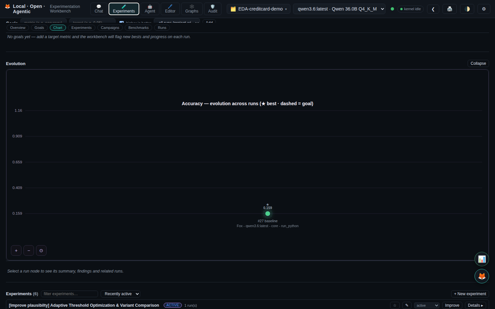
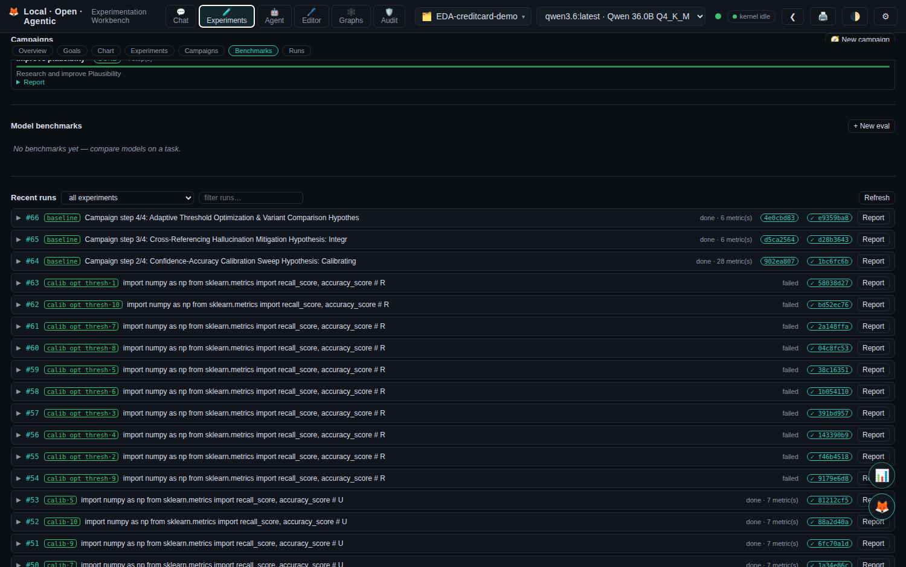
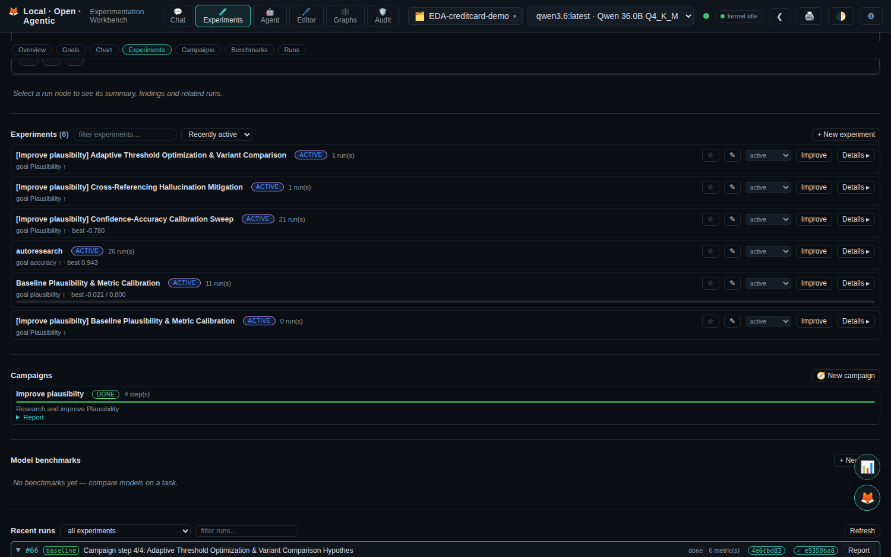
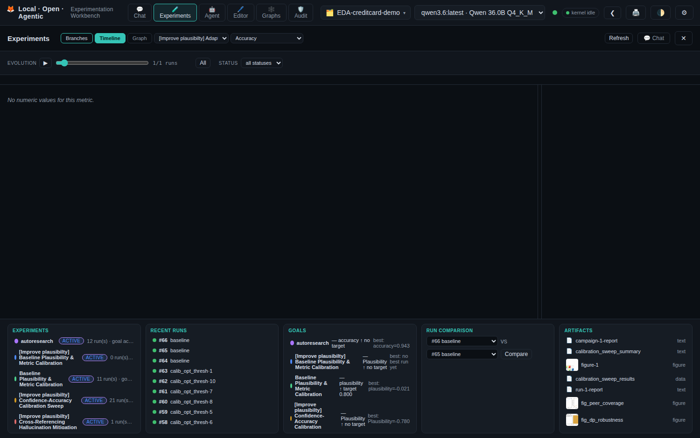

# Local - Open - Agentic Experimentation Workbench

A fully local, open-source experiment workbench: the local-models equivalent of
"Claude Science". It runs entirely on your machine with local LLMs (via Ollama),
so your data never leaves home unless you explicitly approve a network command.
The assistant persona is **Fox** (🦊).

## Documentation

- **GitBook** — the full, navigable documentation site: see
  [gitbook/SUMMARY.md](gitbook/SUMMARY.md) (quick start, user guide, feature
  deep-dives, REST API reference, data model, CLI, development).
- **Guides** — `HOW-to-USE.md` (practical walkthrough) and `commands.md`
  (chat slash commands).
- **Design notes** — per-feature-round plans under `docs/`.

## Screenshots

**Chat with Fox** — streaming agent turns with provenance labels.


**Experiments overview** — KPIs, the cross-experiment leaderboard, and compact experiment cards.


**Experiment detail** — leaderboard, learnings, and runs in one view.


**Goals** — target metrics with progress bars and reached states.



**Campaigns** — background research investigations.



**Model benchmarks** — compare the workbench's LLMs on a task.


**Run detail** — expandable metrics, config, tool trail, and actions.



**Improve-loop lineage** — the git-flow branch graph.



**Generated report** — the project write-up rendered in chat.


**Audit trail** — tamper-evident, hash-chained event timeline.


> Screenshots are illustrative (a seeded "Demo" project); the audit view shows
> real recorded events.

Following the plan in `plan.md`, it provides the core Phase 0–3 stack:

## What's New — Core hardening: SQLite, kernels, turn recording (2026-09)

**🔧 Thread-safe SQLite** — one connection per (database, thread) instead of one
shared connection, so parallel agent turns and background workers never share a
cursor (`WAL` + 30 s busy timeout; dead-thread connections reaped).

**🔧 Kernel subprocesses always reaped** — `PythonKernel.stop()` now holds the
proc handle across kill and awaits it (previously the wait never ran → zombie
`ResourceWarning` noise); new `discard_runtime()` test helper stops kernels
before dropping a runtime.

**🔧 Turn recording can't mask replies** — transcript persist + run record
failures are logged, never raised into the turn result.

Suite: 787 tests green. See [Architecture](gitbook/development/architecture.md)
(Concurrency) and [Testing](gitbook/development/testing.md).

## What's New — Focus view + responsive shell (2026-09)

**🎯 Focus view — simplified session experimentation** — new optional main
view beside Chat: one screen per session with five tabs (Chat, Experiment
code, Branch history, Experiment tracking, Remote execution) sharing the
existing backend endpoints (no new APIs). Branch nodes jump to Code, Code
jumps to Remote, remote runs land back in Tracking; the toolbar session
selector follows the active session. See [Focus view](gitbook/user-guide/focus-view.md).

**Top bar + shell redesign (1512px MacBook-tuned)** — horizontally scrolling
tab strip with edge fades and active-tab auto-scroll (icon-only below
1100px); model and session pickers as compact overlay controls; uniform 12px
topbar type; side rail becomes an overlay drawer below 1100px; chat capped at
~1000px centered; consistent card headers; antialiased type, button states,
quiet scrollbars, and always-visible keyboard focus.

## What's New — Multi-GPU findings on axiom 2× RTX5080 (2026-09)

**🖥 Remote agent deployables** — `bin/build-remote-agent.sh` builds a 44–52K
tarball (kernel sources only, closed dep set: stdlib + fastapi/uvicorn);
`deploy/remote-agent/` adds a GPU `Dockerfile` (269MB), a torch-baked
`Dockerfile.cuda` (9GB, survives recreates), `docker-compose.yml` (NVIDIA
reservation, fail-fast `REMOTE_TOKEN`), `.cpu` override, `install.sh`
(venv + host-generated token + smoke test incl. 403 check) and a hardened
systemd unit. Axiom runs `fox-kernel:cuda` (torch 2.14+cu130) — paired in the
Remote tab via a Mac-host relay (`bin/axiom-relay.py` + LaunchAgent) because
Docker Desktop blocks container→LAN egress.

**📊 DataParallel crossover (project `axiom-gpu-sweep`, all `kind="remote"`)** —
single-GPU fp16 plateaus at ~119.7 TFLOPS; DP crosses over at **1.10×** for
H=4096/B=32K, loses at smaller configs (0.96–1.02×), and OOMs where single
fits: **batch size beats width** (same element counts, different outcomes —
all-reduce bytes dominate), and **replication can't escape the capacity wall**
(FSDP needed past it). Dual-matmul control: **242.4 combined TFLOPS** at
single-GPU wall time. Full table + bugfixes (60s worker-timeout kill, 30s
relay sever): [docs/REMOTE-WORKBENCH.md](docs/REMOTE-WORKBENCH.md) §7.

## What's New — Remote hardening + narrow-AGI fixes (2026-09)

**🖥 Remote hardening** — env-seeded hosts now have stable `seed-*` ids (host
selection survives across requests); a masked token with no live token clears
to empty so Bearer auth fails closed instead of sending the mask; URLs are
normalized and any `user:pass@` userinfo is stripped (credentials belong in
the token field, never in `base_url`). 19 unit tests in `tests/test_remote.py`.

**🌌 Narrow-AGI fixes** — `GET /api/hive/journey` finally returns the
feature-by-feature `agi_features[12]` grid (8 available, 4 honestly
unavailable with reasons — `typer`/`feedparser` are the optional `[hive]`
extra), probed by real import instead of `find_spec` (which over-claimed).
New `full_workbench_profiles()` helper is the single source for both
`/api/hive/workbench/profiles` and Journey (full YAML fields everywhere);
Journey also surfaces Learn Loop status (ledger rewards → memory → snapshots)
with its own card, and `GET /api/hive/research/sessions` degrades to
503 + hint instead of 500 without the `[hive]` extra.

**🔌 Passwordless axiom tunnel** — [docs/REMOTE-WORKBENCH.md](docs/REMOTE-WORKBENCH.md):
Tailscale on both ends (MagicDNS `http://axiom:8891`), Tailscale SSH or
key-only OpenSSH with `PasswordAuthentication no`, token generated on axiom
(`openssl rand -hex 32` → `/etc/fox-kernel.env`, 600), tailnet-only firewall,
hardened systemd unit at [deploy/axiom/fox-kernel.service](deploy/axiom/fox-kernel.service).
No passwords are exchanged or stored anywhere in the repo. API reference:
[gitbook/reference/api.md](gitbook/reference/api.md) (Hive companion, Remote
workbench); env vars: [gitbook/reference/environment-variables.md](gitbook/reference/environment-variables.md).

## What's New — Remote workbench on LAN/Tailscale (2026-09)

**🖥 Remote workbench — deployable hive-machine agents** — run `fox-kernel` on another machine (e.g. axiom, 2× RTX5080) and offload experiments from the workbench over LAN or Tailscale. No SSH: the agent exposes `GET /api/kernel/gpu` (nvidia-smi discovery) and token-guarded `POST /api/kernel/execute` (`REMOTE_TOKEN` → Bearer). The workbench **Remote tab** configures hosts (name, base URL, user, token), **Discovers** them on demand (`/health` 5s + `/gpu` 8s timeouts, no background pollers), shows per-host GPU cards (VRAM free/used, util, temp), and offloads code — results come back as `kind="remote"` runs with host/duration/GPU metrics. Hosts persist in `config.json` (tokens redacted like kaggle keys); `REMOTE_HOSTS`/`REMOTE_TOKEN` env seeds first run. Deploy on axiom: `REMOTE_TOKEN=<token> python -m backend.kernels.server --host 0.0.0.0 --port 8891`. Full passwordless tunnel setup (Tailscale + key-only SSH + systemd + firewall): [docs/REMOTE-WORKBENCH.md](docs/REMOTE-WORKBENCH.md) with deploy unit at [deploy/axiom/fox-kernel.service](deploy/axiom/fox-kernel.service).

## What's New — Hive + Journey + Auditable AGI Loops (2026-09)

**🐝 Hive Research Companion — local Feynman clone + Perplexity Computer** — integrated from [`hive-research-CLI`](https://github.com/harishgovardhandamodar/hive-research-CLI) (`hive/` → `hive_companion/` + symlink `hive` → `hive_companion`, `Dockerfile.hive`, `pyproject.toml [hive]`). All LLM stays local (Ollama/LM Studio). New service `fox-hive` (`:8000`, profile `hive`) shares `fox_data` + `hive_workspace` + host `~/.hive` (ledgers). Run `docker compose --profile hive up -d --build`.

**🧠 Narrow AGI Workbenches** — one YAML per domain (`hive/workbench/profiles.py:list_workbenches()`) with `description`, `domain`, `datasets`, `allowed_tools`, `model_preference`, `prompts`, `evaluation`, `constraints` + scoped `memory/tools/reward`. Example profiles: `fox-fraud`, `quai-lora`, `diabetes`, `eda-credit`, `privacy`. Exposed via `GET /api/hive/workbench/profiles` and `POST /api/hive/workbench/loops/run` (sandboxed via Hive-Machine).

**📈 Journey to achieve AGI — Narrow Space AGI Dashboard** (`#journey`, `GET /api/hive/journey`) — collects **all** narrow workbench metrics (18 workbenches: 5 Hive YAMLs + 13 Fox projects) + `latest_metric` + `artifacts` + `audit_events` → `progress = fox_with_runs/narrow_count*100` (55.6%) + `overall`. Shows **Collection Scheme** (Discover→Collect→Aggregate→Visualize), **Overall Progress** bar, **Audit Health**, **Narrow Workbenches — All AGI Workbench Elements** (full YAML per card), **Experiment — Narrow AGI Run (gathers all)** with `narrow_runs` (12) + `charts` (8 `png/svg`) + `mermaid` (4), and **AGI Workbench — Narrow Spaced Ideal Experimentation** with `ledgers` (20, hash-chained `~/.hive/ledger.db` `executions` table) + `auditable_proofs` (20, `~/.hive/machine/audit.db`).

**🔍 Auditable Logs with AGI Loops — Timeline Graphs** (`#hive`, `GET /api/hive/audit/timeline`) — nodes=`actor` (`hive-machine`, `research-companion`, `user`, `ollama`), edges=`action` (`run_code`, `synthesize`, `chat`) `seq`+`timestamp`, **clickable overlays** with all captures (`arguments`, `result`, `filesystem`, `network`, `policy`, `hash` chain). Every `POST /api/hive/workbench/loops/run` hash-chains an `AuditEvent` (`agent_id=profile`, `method=run_narrow_loop`) to `LocalAuditStore`. All **ledger entries clickable** (`GET /api/hive/journey` `ledgers` now `SELECT *` with `hash`/`prev_hash`).

**💾 Persist all data vs `docker` resets** — `docker-compose.yml` volumes now explicit `name: ai-research-workbench_*` + host bind `${HOME}/.hive:/root/.hive` (fox, hive, code-server) so `fox_data`, `ledger.db`, `personal-experiments` survive `docker compose down` (without `-v`). New `bin/backup.sh` (snapshots `fox_data`, `hive_workspace`, etc. + `personal-experiments`, `~/.hive` to `backups/<vol>-<timestamp>.tar.gz` via `alpine tar`) and `bin/restore.sh --latest`.

**🧪 UPI Peer Identification — Re-identification & Peer Benchmarking** — 550k `indian_banking_transactions.csv` + 250k `upi_transactions_2024.csv` ingested to `UPI-Peer-identification/data/` (also `personal-experiments`), 4 experiments (`reidentification_risk` 9.4% vs 16.3%, `peer_precision` 0.913, `linkage 39.4%` → mitigated `0.77%`), peer groups 1500/3996, bank-bank pairs 8×8 (Axis-HDFC 581 etc., plaus 0.65-0.99), plausibility heatmaps (`state×merchant`, `bank×merchant` `log1p` normalized 0.0-1.0, not 1.00), all inline in chat `UPI-Peer-identification` (Qwen3.8:27b-mlx, 7 messages, 35 artifacts, `report.md` 252 lines).

## What's New

**🤖 LangGraph orchestration (reliable agents)** — the agent loop is now also
available as an explicit LangGraph state machine (`invoke → tools → [check]`)
behind an off-by-default flag: set `FOX_ORCHESTRATOR=langgraph` to enable a
**JSON-schema-enforced QA gate** that verifies each final answer is complete and
supported by the tool outputs and feeds corrective instructions back, plus a
per-turn step budget and cooperative Stop. The classic loop stays the default,
and both loops share one tool executor (`Coordinator._exec_tool_call`), so
events, audit, artifacts and run records are identical. Optional deps:
`pip install -e ".[agent]"` (already baked into the Docker image). See
[docs/langchain-orchestration-plan.md](docs/langchain-orchestration-plan.md).

**🦊 Chat provenance labels** — assistant bubbles now read
**Fox - <model> - <MCP> - <action>** (e.g. `FOX - QWEN3.6:LATEST - GITHUB - PUSH`)
instead of a bare "Fox", so a glance shows which model and which MCP tool produced
the reply. The MCP/action tags are clickable to filter the chat, and the same
info appears in the Experiments timeline, graph and run-detail panels. The model
that produced each run is persisted per-run and shown across those views.

**📊 Server resource HUD (DGXTOP-style)** — a floating 📊 button toggles a faded,
translucent overlay showing live host CPU / memory / load, per-GPU utilization,
temperature, power and memory (`nvidia-smi`), and a top-process table — served by
the backend at `/api/system/stats` (cached), polling every 4s, sharpening on
hover. The chat window also jumps to the latest message on refresh/project switch.

**🦊 Headless kernel server** — the persistent Python kernel now runs as a
standalone app (`fox-kernel` / `python -m backend.kernels.server`) with a REST +
WebSocket API for executing code, inspecting variables/env, resetting state and
**streaming live execution status** (idle/busy, current code, pid, uptime) and
stdout as code runs. The workbench connects through a **remote kernel client**
(`make_kernel_manager(..., remote_url=...)` / `FOX_KERNEL_URL`), so execution
can run on another host while the UI reflects its real status. The web app now
shows a **kernel status pill** in the top bar plus a live status panel on the
Kernel tab, and every kernel execution is recorded in the **audit trail**
(`source=kernel`, busy/idle/output/reset events).

**🛡 Local agent audit trail** — every agent tool call, MCP request, permission
decision, network access and filesystem touch is now captured, **redacted** and
**hash-chained** (SHA-256, tamper-evident) into SQLite + append-only JSONL per
project. The new **Audit Trail** view in the top bar shows a severity-coloured
**event timeline** with **clickable KPI cards** (Events / Critical / Overrides /
Denials / Data access / Network / Filesystem / Open deviations / Active agents)
that filter the list, plus per-agent history, a **permissions vs observed
drift** panel, an **Investigation** search tab, and **deviation flags**
(novel tools, network destinations, data classes) with scan/review/false-positive
workflow. Ships with a standalone **`agent-audit`** CLI, a transparent **MCP
proxy** for Claude Desktop / Cursor / custom hosts, Python middleware
(`@audit_tool`), a Streamlit dashboard, and a **hash-chain integrity check**.
See [docs/AUDIT-TRAIL.md](docs/AUDIT-TRAIL.md) and the `fox audit <project>`
command.

**⛙ Git-flow branch history** — experiments now carry a **git-style branching
lineage**: each run records the run it was derived from (`parent_run_id`, set
automatically for improve-loop iterations, fresh reruns, autoresearch attempts
and workflow reruns; inferred chronologically otherwise). The **Branches**
overlay (button next to the chat composer, or **⛙ Experiment branches** in the
Experiments toolbar) renders the lineage as a branch timeline — nodes carry
their **experiment parameters** (config + metrics), best runs are starred,
branch tips are marked, and clicking a node shows its objective, summary,
findings and review notes. The overlay now opens on the **Timeline** view by
default.

**🏆 Best contender parameters** — every experiment surfaces its leading
candidate: a per-experiment **leaderboard** ranks each run by the goal metric
(🏆 best, Δ-vs-best deltas), the **best run is starred (★)** across the
timeline, graph and branch views with its **experiment parameters** (config)
shown inline, and **⇄ Compare vs best** (button in the run detail) diffs any
run against the current best contender so you can see exactly which
parameters changed.

**🔧 Source-control & UX polish** — experiment commits/pushes are now
**Git-LFS-safe**: the management repo ships a `fox/.gitattributes` that exempts
snapshot files from LFS filters, so `git add`/`commit`/`push` no longer fail
with `clean filter 'lfs' failed` on hosts without `git-lfs` installed. The
light theme got a readability pass so **user bubbles keep readable light text**
on their dark-green background.

**🧭 Session control & symbolic top bar** — projects are managed through a
single **session control**: one `🗂` widget in the top bar (open a session,
fork it, or delete it) replaces the old project dropdown plus `+` / fork /
delete buttons. The top bar went **symbolic** — one-emoji tabs (💬 Chat,
🧪 Experiments, 🤖 Agent, 🖊 Editor, 🕸 Graphs, 🛡 Audit) and icon-only actions
(🖨 Export PDF, ⚙ Settings).

**🎛 Branch history with evolution** — the experiment branch overlay
(Branches / Timeline / Graph) was re-engineered to de-clutter and visualize
evolution. The **🌲 Compact** toggle collapses linear runs between forks into a
readable skeleton (roots, forks, merges, best ★, branch tips ⦿); **status** and
**experiment** filters narrow the view; and a **time / evolution slider** reveals
the history run-by-run — draggable, or **▶ play** animates one run per second —
in all three views (labels auto-hide past 40 runs, and Timeline/Graph keep their
positions stable while scrubbing).

**🕸 Interactive knowledge graph** — the knowledge-graph viewer is now
**weighted and draggable**: edge weights (relation-derived, or an explicit
`weight` from the graph JSON) scale spring attraction and edge thickness;
**drag any node** and the graph re-settles around it in real time, with dragged
nodes **pinned** until Relayout; and a **⚖ weight-strength slider** tunes how
strongly weights shape the layout (0 = uniform, 200 = amplified).

**🌗 Light-mode readability** — code blocks, inline code, user tags, session
dropdowns and chart labels are now readable in light mode (no more white-on-
white).

**🔧 LoRA/QLoRA fine-tuning with live monitoring** — two new MCP servers:
`dk_lora` (LoRA/QLoRA training: workspace job store, dataset prep, unsloth or
plain-Trainer backends) and `ft_validate` (RAG-index verification that scores
the base model against the trained adapter). The GUI surfaces training live:
a **Finetune status** panel in the Experiments tab (per-job progress, step/
total, loss/epoch, log tail) and a 🔧 **LoRA finetune** pipeline card in the
chat that streams a **debug-log console** (ingest → dataset → train → verify
stages) plus a persisted finetune session history. Jobs launched from the CLI
stream into the GUI too.

Also in this release: `.env` is now gitignored, and the audit CLI ships via the
`audit` extras (`pip install -e ".[audit]"`).

## Top features

- **Agentic experimentation** — the agent plans experiments, runs variants, and a
  background **reviewer** suggests improvements; the **improve loop** iterates
  run → review → apply → rerun toward a goal metric until it's reached.
- **🤖 Autonomous research loop** — karpathy/autoresearch-style: an experimentation
  agent edits a single target script, the harness runs it under a fixed time
  budget, and keeps a change only when the goal metric improves (else reverts),
  logging every attempt. See the
  [Kaggle Titanic workflow demo](sample-reports/fox-autonomous-reserch-kaggle-workflow.md)
  (screenshots) and [`examples/autoresearch/`](examples/autoresearch/README.md).
  
- **Experiment tracking cockpit** — timeline + similarity graph with experiment
  coloring, goal lines, best-run highlight, per-run **suggestions 💡**, and
  one-click **compare vs best** / **improve from here**; the graph is **weighted
  and draggable** (edge weights drive the layout, drag nodes to re-arrange) and
  both charts share the run-by-run **evolution slider**.
    
- **Git-flow branch history** — a toggleable overlay in the chat window renders
  the experiment lineage as a **git-style branching timeline**: experiments are
  branches, each run (baseline, improve-loop iteration, fresh rerun) is a node
  with its **experiment parameters** (config + metrics), best runs starred and
  branch tips marked. Filter by experiment/status, collapse linear runs with
  **🌲 Compact**, and scrub a **run-by-run evolution slider** (▶ plays one run
  per second) across the Branches, Timeline and Graph views. Use the **⛙
  Branches** button next to the chat composer.
- **Experiment source control** — version experiments, runs and artifacts in a
  sibling git repo (e.g. `personal-experiments`) with **auto-commit/push to
  GitHub** and manual Commit/Push buttons; see
  [HOW-to-USE.md → Experiment source control](HOW-to-USE.md#experiment-source-control-management-repo).
- **⚡ God mode** — run an experiment with full access (shell/network/MCP
  auto-approved) inside a quarantined per-turn sandbox.
- **Slash commands** — `/godmode`, `/improve`, `/compare`, `/commit`, `/push`,
  `/kaggle`, `/notebook`, `/status`, `/help` and more; see [commands.md](commands.md).
- **GitHub MCP server** — status / commit / push / pull tools the agent can call,
  plus sibling-repo discovery for the management repo.
- **Kaggle dataset import** — pull any public dataset into the project
  (`/kaggle alexisbcook/titanic` or the Files panel).
- **Chat + tool-calling agent** against local models (OpenAI-compatible), with
  live streaming, Stop button, copy, timestamps, and grouped/navigable sets.
- **Persistent, sandboxed Python kernel** — variables, dataframes and figures
  survive across turns.
- **Artifact system with full provenance** — every figure/table records its exact
  code + environment snapshot, stored in SQLite + filesystem.
- **Background reviewer agent** that checks claims against the execution history.
- **Permission model** — shell commands ask before running; network is deny-by-default.
- **Project workspaces** — SQLite-backed sessions, per-project kernels.
- **Figure annotation / regeneration** — "remove the gridlines" regenerates the figure.
- **Built-in VS Code editor** — edit agent-generated scripts in-app.
- **Workflow progress panel** — live per-stage progress for improve loops, arXiv
  replication, the privacy workflow, notebooks, and any agent tool run.
- **🛡 Local agent audit trail** — every agent tool call, MCP request,
  permission decision, network access and filesystem touch is captured,
  **redacted** and **hash-chained** (tamper-evident) into SQLite + append-only
  JSONL, then shown in an **Audit Trail** view with a **timeline of events**,
  KPI cards, agent history, deviation flags and permission-vs-observed drift.
  Includes a standalone `agent-audit` CLI, a transparent **MCP proxy** for
  Claude Desktop / Cursor / custom hosts, and Python middleware (`@audit_tool`)
  for your own agents. See [docs/AUDIT-TRAIL.md](docs/AUDIT-TRAIL.md).
- **🐝 Hive Research Companion — local Feynman + Perplexity Computer** — sandboxed **Hive-Machine** (files/code/web/terminal, `~/.hive/machine/workspace`), **AGI Workbench** (one YAML per domain with `description`/`domain`/`datasets`/`allowed_tools`/`model_preference`/`prompts`/`evaluation`/`constraints` + scoped memory/tools/reward, e.g. `fox-fraud`, `quai-lora`), **Research Workflows** (OpenAlex/arXiv/CrossRef/Europe PMC → local Ollama/LM Studio synthesis), **Paper System**, **Learn Loop** (ledger→reward→memory/rank), **Ledger** (SQLite+hash chain, gathering invariant), **TUI/CLI/Web** — all local, no cloud. New service `fox-hive` (`:8000`, profile `hive`) shares `fox_data` + `~/.hive`. Web at `/#hive`.
- **🌌 Journey to achieve AGI — Narrow Space AGI Dashboard** (`#journey`, `GET /api/hive/journey`) — collects **all** narrow workbench metrics (18: 5 Hive YAMLs + 13 Fox projects) + `latest_metric` + `artifacts` + `audit_events` → `progress`/`overall`, shows **Collection Scheme** (Discover→Collect→Aggregate→Visualize), **Overall Progress** bar, **Audit Health**, **Narrow Workbenches — All AGI Workbench Elements** (full YAML per card), **Experiment — Narrow AGI Run (gathers all)** (`narrow_runs` 12, `charts` 8, `mermaid` 4), **AGI Workbench — Narrow Spaced Ideal Experimentation** (`ledgers` 20, `auditable_proofs` 20 hash-chained) and **Timeline** (nodes=actor, edges=action seq+timestamp, clickable captures). See `hive/workbench/profiles.py`.
- **🔍 Auditable Logs with AGI Loops — Timeline Graphs** (`#hive`, `GET /api/hive/audit/timeline`) — nodes=`actor` (`hive-machine`, `research-companion`, `user`, `ollama`), edges=`action` (`run_code`, `synthesize`, `chat`) `seq`+`timestamp`, **clickable overlays** with all captures (`arguments`, `result`, `filesystem`, `network`, `policy`, `hash` chain). Every `POST /api/hive/workbench/loops/run` hash-chains an `AuditEvent` to `LocalAuditStore`.
- **💾 Persist all data vs `docker` resets** — `docker-compose.yml` volumes `fox_data`, `hive_workspace`, `~/.hive` bind (`${HOME}/.hive:/root/.hive`) survive `down` (without `-v`); `bin/backup.sh`/`bin/restore.sh` snapshot volumes + host binds to `backups/` (e.g. `fox_data-20250101.tar.gz`).
- **🧪 UPI Peer Identification — Re-identification & Peer Benchmarking** — 550k `indian_banking_transactions.csv` + 250k `upi_transactions_2024.csv` ingested to `UPI-Peer-identification/data/` (also `personal-experiments`), 4 experiments (`reidentification_risk` 9.4% vs 16.3% → mitigated 0.77%, `peer_precision` 0.913, `linkage 39.4%`), peer groups 1500/3996, bank-bank pairs 8×8 (plaus 0.65-0.99), heatmaps (`log1p` normalized 0.0-1.0), inline in chat `UPI-Peer-identification` (Qwen3.8:27b-mlx, 7 messages, 35 artifacts).
- **📊 EDA MCP suite** — five focused MCP servers (data profiler, univariate,
  multivariate, visualizer, report generator) that together profile any
  dataset, analyse it, visualise it and compile a **professional EDA report**
  (Markdown / HTML / PDF), with a shared `dataset_id` store and a **LangChain
  orchestrator** — all **local-only** (optional narrative uses a local model).
  Try it in chat ("run EDA on my dataset…") or from the CLI with
  `fox eda <dataset>`. See
  [mcp_servers/eda_mcp/README.md](mcp_servers/eda_mcp/README.md) and the
  [Iris sample report](sample-reports/eda/iris/report.md).
- **Built-in workflows** — privacy peer-exploitation / red-team / DP-robustness,
  and arXiv ingestion → knowledge graph → replication.

## Architecture

```
Frontend (vanilla JS, served by FastAPI)   ← /ws chat + /api
Backend (FastAPI + asyncio)
  ├─ Coordinator agent (tool loop) + Reviewer agent
  ├─ Tool registry  (run_python, run_r, run_shell, save_artifact, ...)
  ├─ Kernel manager (persistent Python subprocess; figure capture; env snapshot)
  ├─ Artifact store (SQLite + filesystem, provenance)
  └─ Permission manager (allow / ask / deny)
LLM routing (hybrid, 100% local):
  ├─ Gateway  http://localhost:8081/v1   → plain chat, model list (hive cluster)
  └─ Direct   http://127.0.0.1:11434/v1  → tool-calling turns (Ollama)
```

### LLM routing

The workbench defaults to the hive cluster gateway (`http://localhost:8081/v1`,
the Go cluster in `~/WorkBook/Ollama-local-hives-cluster`) for model listing and
plain chat. Tool-calling turns go **directly to local Ollama**
(`http://127.0.0.1:11434/v1`) because the hive gateway currently strips `tools`
from OpenAI requests. Both are local; change them under **Settings**.

### Requirements

- Python 3.12+
- A local Ollama server (or any OpenAI-compatible endpoint)
- Models with tool-calling support (e.g. `qwen3.6:latest`, `glm-4.7-flash:bf16`,
  `gemma4:31b`). Tiny models like `llama3.2:3b` work but are less reliable.

## Quickstart

```bash
python3 -m venv .venv
.venv/bin/pip install -r requirements.txt
.venv/bin/pip install numpy pandas scipy matplotlib scikit-learn   # kernel stack
./run.sh                 # starts http://127.0.0.1:8765
```

Open http://127.0.0.1:8765, pick a model (Settings → Test connection), and chat.
Everything is stored under `workbench/projects/<name>/` (SQLite + artifacts).

## Command-line interface (`fox`)

A zero-dependency terminal CLI (opencode-style UI) for the same backend:

```bash
./bin/fox                 # animated fox splash + interactive `>` shell
fox status                # server / model / research overview
fox doctor                # environment + server health checks
fox serve                 # launch the workbench server

fox projects list         # manage projects (new/show/rm/fork)
fox runs <project>        # agent runs
fox run <project> <id>    # single run detail  (… report = lab-notebook report)
fox experiments <proj>    # list experiments (… start, run-obfuscation)
fox experiment <p> <id>   # experiment detail  (… ranking = leaderboard)
fox compare <p> <a> <b>   # metric delta between two runs
fox eda <dataset>        # exploratory data analysis + report (--llm local narrative)

fox research list         # research scenarios
fox research loop <sid>   # run a full autoresearch loop
fox graph                 # knowledge-graph stats (papers/concepts/relations)
fox papers search <q>     # search the KG;  papers add <arxiv|url|query> ingests
fox jobs                  # background job list
fox scheduler             # research scheduler status
fox pool                  # research pool / topics / imports

fox manage status         # experiment management repo (commit/push/link)
fox audit <project>       # agent audit trail (overview/events/deviations/agents/verify)
fox manual                # the manual (or: fox manual <section>)
```

Every data command emits machine-readable JSON with `--json` (stable exit
codes for scripting); `--debug` logs HTTP tracing to stderr. Subcommands accept
`--help`; run `fox` with no arguments to open the **opencode-style terminal
window** (header status bar, streaming output panel, history + tab-completion;
`fox tui` for the window explicitly, `Ctrl+D` to quit). Point it at a remote
server with `FOX_URL` or `--url`. Full user guide:
[docs/CLI.md](docs/CLI.md), or `fox manual` / `cli/manual.md`.
Completion scripts for bash/zsh ship in [`completions/`](completions/).

## Run with Docker (persistent data)

Builds the workbench into a container. Projects, artifacts and config live in the
named volume `fox_data` (mounted at `/app/workbench`), so your data survives
container restarts and rebuilds.

```bash
docker compose up -d --build
# open http://127.0.0.1:8765
```

By default the container talks to Ollama / the hive gateway running on the **host**
via `host.docker.internal` (Linux uses `extra_hosts` → `host-gateway`). Override with
environment variables:

```bash
FOX_BASE_URL=http://host.docker.internal:8081/v1 \
FOX_TOOL_BASE_URL=http://host.docker.internal:11434/v1 \
FOX_MODEL=qwen3.6:latest \
docker compose up -d --build
```

Optionally run Ollama itself as a container (instead of the host one):

```bash
docker compose --profile ollama up -d --build
# then point the workbench at it (Settings → LLM) using http://ollama:11434/v1
```

Other useful commands:

```bash
docker compose logs -f fox      # follow logs
docker compose down             # stop (data is kept in the volume)
```

## In-browser VS Code editor (edit generated content)

`docker compose up` also starts a **code-server** sidecar (`codercom/code-server`)
sharing the same `fox_data` volume, so everything the agent generates — reports,
notebooks, knowledge graphs, project files — can be opened and edited in a full
VS Code editor running in your browser.

- Open the **Editor** tab in the top bar (or go to <http://127.0.0.1:8787>).
  The editor opens the workbench volume at `/home/coder/workbench`, which mirrors
  `/app/workbench` inside the fox container.
- No login by default. To require one, set `CODE_SERVER_AUTH=password` and a
  `CODE_SERVER_PASSWORD`.
- The agent can also drive the editor as part of its workflow via the
  `editor__list_files` / `editor__read_file` / `editor__edit_file` /
  `editor__open` tools (edits ask for approval, like `run_shell`).

Configuration (all optional):

```bash
CODE_SERVER_AUTH=password \
CODE_SERVER_PASSWORD=my-password \
FOX_EDITOR_URL=http://127.0.0.1:8787 \
docker compose up -d --build
```

See **[docs/VSCODE-EDITOR.md](docs/VSCODE-EDITOR.md)** for the full how-to:
opening the Editor tab, editing generated content, the agent's `editor__*`
tools, path mapping, configuration and troubleshooting.

## Model Context Protocol (MCP) support

The workbench is an **MCP Host**: it discovers tools from local (`stdio`) and remote
(`streamable HTTP`) MCP servers and merges them into the agent's tool set, so the
local LLM can call database connectors, domain tools, etc. — the same servers that
Claude, Cursor or VS Code could use.

- Tool names are namespaced `<server>__<tool>` (e.g. `science__uniprot_lookup`).
- A built-in **`mcp_servers/science_tools.py`** server ships tools for sequence
  GC content, peptide mass, Kyte–Doolittle hydrophobicity, an offline UniProt
  mock connector, and Welch's t-test. Run it standalone or use it from the workbench.
- A built-in **`mcp_servers/privacy_tools.py`** server ships local-first privacy
  tooling: PII detection, dataframe privacy assessment, red-team / membership-
  inference / re-identification evaluation, differential privacy (Laplace /
  Gaussian, budget tracking, ε-gauge) and synthetic-data generation. See
  `docs/PRIVACY-MCP.md`. A privacy workflow (peer-in-distribution exploitation →
  red-team corner cases → DP robustness → audit trail) auto-runs when you ask
  for it in chat — reports and figures land in the Artifacts panel.
- A built-in **`mcp_servers/robustness_tools.py`** server evaluates adversarial
  robustness (ART FGSM/PGD on sklearn, robustness metrics, checklist, simple
  FGSM perturbation) — see `docs/Add_MCP_adversarial_robustness_evaluation.md`.
- A built-in **`mcp_servers/arxiv_replication.py`** server turns an arXiv paper
  into a research workflow: ingest (metadata + PDF), summarize, structured
  notes, experiment spec, result comparison, a provenance-linked replication
  report, and a queryable **knowledge graph** (Paper/Author/Method/Dataset/
  Metric/Experiment/Claim) that can be merged across papers (`arxiv__*` tools).
- A built-in **`mcp_servers/graphrag_tools.py`** server adds lightweight
  **GraphRAG**: `graphrag__graphrag_retrieve` scores nodes against a query,
  expands their neighbourhood over the knowledge graphs, and returns an
  LLM-ready subgraph context; `graphrag__graphrag_answer_prompt` turns it into a
  provenance-citing answer prompt.
- A built-in **EDA MCP suite** (`mcp_servers/eda_mcp/`) adds five servers —
  `eda_profiler`, `eda_univariate`, `eda_multivariate`, `eda_visualizer`,
  `eda_report` — that profile, analyse, visualise and report on any dataset
  (shared `dataset_id` workspace, plots + Markdown/HTML/PDF reports). See
  `mcp_servers/eda_mcp/README.md`.
- A built-in **`mcp_servers/dk_lora/`** server (`dk_lora__*` tools) runs
  **LoRA/QLoRA training** on any HuggingFace base model + dataset: jobs live in
  a workspace (`jobs/<id>.{json,log,py}`), with dataset prep, unsloth or
  plain-Trainer backends, and `[dk-metric]` log lines. The workbench GUI shows
  live progress (Experiments → Finetune status, and a 🔧 pipeline card + debug
  log in the chat) — see `gitbook/features/finetune-status.md`.
- A built-in **`mcp_servers/ft_validate/`** server (`ft_validate__*` tools)
  **verifies a trained adapter** vs its base model: builds a RAG index over the
  evaluation corpus, samples an eval set, scores base-vs-adapter responses, and
  writes a comparison report — see `gitbook/features/finetune-status.md`.
- A built-in **`flint`** MCP server (`flint__*` tools) renders **Flint semantic
  chart specs** locally (Vega-Lite / ECharts / Chart.js): `render_chart`,
  `compile_chart`, `validate_chart`, `list_chart_types`, `list_themes`, and
  `create_chart_view` (interactive chart UI). Node-based — installed in the
  container via `npm install -g flint-chart-mcp`. See
  <https://microsoft.github.io/flint-chart/>.
- Add/remove servers under **Settings → MCP** (stdio command+args, or HTTP URL +
  headers), then re-save; status and tool counts are shown.
- **Human-in-the-loop**: tools annotated read-only run freely; anything that may
  write data or launch compute asks the user before running (one-time grant).

```bash
.venv/bin/pip install mcp        # optional; enables MCP support
```

Demo prompts:

> "Use the MCP science tools to compute the GC content of ATGCCGTAATG and look up
> UniProt P04637."

> "Run privacy__assess_dataframe_privacy on the clinical cohort, then apply
> privacy__apply_laplace_dp to the admission counts with ε=0.5."

> "Exploit privacy as a peer in the distribution, run red-team corner cases,
> apply DP and check robustness, and document the whole process as an audit trail."

## Jupyter integration (run as an addon inside Jupyter)

Run the whole workbench as a `jupyter_server` extension, so the AI Science
Workbench becomes a panel at `/fox` inside your Jupyter server (single origin,
shared port):

```bash
.venv/bin/pip install jupyter_server        # optional dependency
./run-jupyter.sh                            # starts jupyter on :8888
# open  http://localhost:8888/fox/
```

How it works: the extension (`jupyter_fox/`) spawns the workbench FastAPI app as a
sidecar subprocess on an ephemeral localhost port, then proxies HTTP and WebSocket
traffic to it under the `/fox` prefix — chat, persistent kernel, artifacts,
reviewer and notebook execution all work inside Jupyter. The frontend auto-detects
the `/fox` base path (see `FOX_BASE` in `frontend/`). Enable/disable with
`jupyter server extension enable/disable jupyter_fox`.

Notebook experiments stored in a project's `notebooks/` folder are plain
`.ipynb` — you can also open them in JupyterLab's normal notebook view.

## Try the demo experiments

See `examples/README.md`. 3 script experiments plus **18 Jupyter notebooks**
(`examples/notebooks/`, built by `examples/build_notebooks.py`) spanning tiny →
large across statistics, kinetics, PDEs, single-cell, epidemiology, time series,
omics, physics, ML and image processing — 54 executable cells producing 32
figures, all runnable inside the workbench or as addon in Jupyter.

## Security model

- `run_python` runs inside the persistent kernel subprocess (isolated per project).
- `run_shell` always prompts the user; network and destructive commands are
  flagged and denied unless explicitly approved.
- Nothing leaves the machine unless you approve a network command.

## Status / roadmap

Implemented: chat + tool calling, persistent kernels, artifacts + provenance,
reviewer, permissions, regeneration, projects. Next phases from the plan:
scientific renderers (3Dmol/igv/RDKit), SSH/Slurm compute, skills/connectors.
