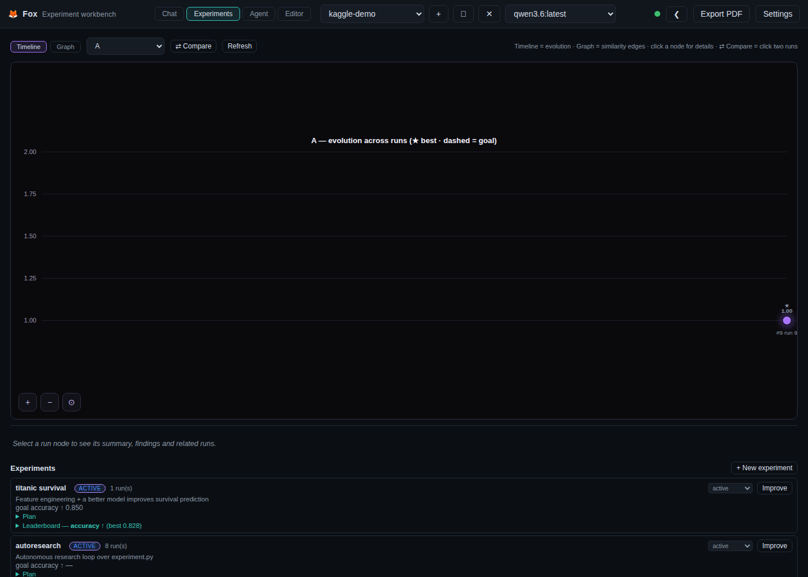
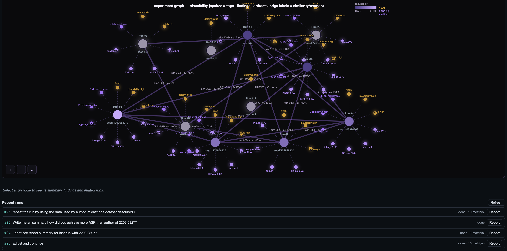

# Fox - Experiment workbench

A fully local, open-source experiment workbench: the local-models equivalent of
"Claude Science". It runs entirely on your machine with local LLMs (via Ollama),
so your data never leaves home unless you explicitly approve a network command.

Following the plan in `plan.md`, it provides the core Phase 0–3 stack:

## What's New

**🦊 Headless kernel server** — the persistent Python kernel now runs as a
standalone app (`fox-kernel` / `python -m backend.kernels.server`) with a REST +
WebSocket API for executing code, inspecting variables/env, resetting state and
**streaming live execution status** (idle/busy, current code, pid, uptime) and
stdout as code runs. The workbench connects through a **remote kernel client**
(`make_kernel_manager(..., remote_url=...)` / `FOX_KERNEL_URL`), so execution
can run on another host while the UI reflects its real status. The web app now
shows a **kernel status pill** in the top bar plus a live status panel on the
Kernel tab, and every kernel execution is recorded in the **audit trail**
(`source=kernel`, busy/idle/output/reset events).

**🛡 Local agent audit trail** — every agent tool call, MCP request, permission
decision, network access and filesystem touch is now captured, **redacted** and
**hash-chained** (SHA-256, tamper-evident) into SQLite + append-only JSONL per
project. The new **Audit Trail** view in the top bar shows a severity-coloured
**event timeline** with **clickable KPI cards** (Events / Critical / Overrides /
Denials / Data access / Network / Filesystem / Open deviations / Active agents)
that filter the list, plus per-agent history, a **permissions vs observed
drift** panel, an **Investigation** search tab, and **deviation flags**
(novel tools, network destinations, data classes) with scan/review/false-positive
workflow. Ships with a standalone **`agent-audit`** CLI, a transparent **MCP
proxy** for Claude Desktop / Cursor / custom hosts, Python middleware
(`@audit_tool`), a Streamlit dashboard, and a **hash-chain integrity check**.
See [docs/AUDIT-TRAIL.md](docs/AUDIT-TRAIL.md) and the `fox audit <project>`
command.

**⛙ Git-flow branch history** — experiments now carry a **git-style branching
lineage**: each run records the run it was derived from (`parent_run_id`, set
automatically for improve-loop iterations, fresh reruns, autoresearch attempts
and workflow reruns; inferred chronologically otherwise). The **Branches**
overlay (button next to the chat composer, or **⛙ Experiment branches** in the
Experiments toolbar) renders the lineage as a branch timeline — nodes carry
their **experiment parameters** (config + metrics), best runs are starred,
branch tips are marked, and clicking a node shows its objective, summary,
findings and review notes.

Also in this release: `.env` is now gitignored, and the audit CLI ships via the
`audit` extras (`pip install -e ".[audit]"`).

## Top features

- **Agentic experimentation** — the agent plans experiments, runs variants, and a
  background **reviewer** suggests improvements; the **improve loop** iterates
  run → review → apply → rerun toward a goal metric until it's reached.
- **🤖 Autonomous research loop** — karpathy/autoresearch-style: an experimentation
  agent edits a single target script, the harness runs it under a fixed time
  budget, and keeps a change only when the goal metric improves (else reverts),
  logging every attempt. See the
  [Kaggle Titanic workflow demo](sample-reports/fox-autonomous-reserch-kaggle-workflow.md)
  (screenshots) and [`examples/autoresearch/`](examples/autoresearch/README.md).
  
- **Experiment tracking cockpit** — timeline + similarity graph with experiment
  coloring, goal lines, best-run highlight, per-run **suggestions 💡**, and
  one-click **compare vs best** / **improve from here**.
    
- **Git-flow branch history** — a toggleable overlay in the chat window renders
  the experiment lineage as a **git-style branching timeline**: experiments are
  branches, each run (baseline, improve-loop iteration, fresh rerun) is a node
  with its **experiment parameters** (config + metrics), best runs starred and
  branch tips marked. Use the **⛙ Branches** button next to the chat composer.
- **Experiment source control** — version experiments, runs and artifacts in a
  sibling git repo (e.g. `personal-experiments`) with **auto-commit/push to
  GitHub** and manual Commit/Push buttons; see
  [HOW-to-USE.md → Experiment source control](HOW-to-USE.md#experiment-source-control-management-repo).
- **⚡ God mode** — run an experiment with full access (shell/network/MCP
  auto-approved) inside a quarantined per-turn sandbox.
- **Slash commands** — `/godmode`, `/improve`, `/compare`, `/commit`, `/push`,
  `/kaggle`, `/notebook`, `/status`, `/help` and more; see [commands.md](commands.md).
- **GitHub MCP server** — status / commit / push / pull tools the agent can call,
  plus sibling-repo discovery for the management repo.
- **Kaggle dataset import** — pull any public dataset into the project
  (`/kaggle alexisbcook/titanic` or the Files panel).
- **Chat + tool-calling agent** against local models (OpenAI-compatible), with
  live streaming, Stop button, copy, timestamps, and grouped/navigable sets.
- **Persistent, sandboxed Python kernel** — variables, dataframes and figures
  survive across turns.
- **Artifact system with full provenance** — every figure/table records its exact
  code + environment snapshot, stored in SQLite + filesystem.
- **Background reviewer agent** that checks claims against the execution history.
- **Permission model** — shell commands ask before running; network is deny-by-default.
- **Project workspaces** — SQLite-backed sessions, per-project kernels.
- **Figure annotation / regeneration** — "remove the gridlines" regenerates the figure.
- **Built-in VS Code editor** — edit agent-generated scripts in-app.
- **Workflow progress panel** — live per-stage progress for improve loops, arXiv
  replication, the privacy workflow, notebooks, and any agent tool run.
- **🛡 Local agent audit trail** — every agent tool call, MCP request,
  permission decision, network access and filesystem touch is captured,
  **redacted** and **hash-chained** (tamper-evident) into SQLite + append-only
  JSONL, then shown in an **Audit Trail** view with a **timeline of events**,
  KPI cards, agent history, deviation flags and permission-vs-observed drift.
  Includes a standalone `agent-audit` CLI, a transparent **MCP proxy** for
  Claude Desktop / Cursor / custom hosts, and Python middleware (`@audit_tool`)
  for your own agents. See [docs/AUDIT-TRAIL.md](docs/AUDIT-TRAIL.md).
- **Built-in workflows** — privacy peer-exploitation / red-team / DP-robustness,
  and arXiv ingestion → knowledge graph → replication.

## Architecture

```
Frontend (vanilla JS, served by FastAPI)   ← /ws chat + /api
Backend (FastAPI + asyncio)
  ├─ Coordinator agent (tool loop) + Reviewer agent
  ├─ Tool registry  (run_python, run_r, run_shell, save_artifact, ...)
  ├─ Kernel manager (persistent Python subprocess; figure capture; env snapshot)
  ├─ Artifact store (SQLite + filesystem, provenance)
  └─ Permission manager (allow / ask / deny)
LLM routing (hybrid, 100% local):
  ├─ Gateway  http://localhost:8081/v1   → plain chat, model list (hive cluster)
  └─ Direct   http://127.0.0.1:11434/v1  → tool-calling turns (Ollama)
```

### LLM routing

The workbench defaults to the hive cluster gateway (`http://localhost:8081/v1`,
the Go cluster in `~/WorkBook/Ollama-local-hives-cluster`) for model listing and
plain chat. Tool-calling turns go **directly to local Ollama**
(`http://127.0.0.1:11434/v1`) because the hive gateway currently strips `tools`
from OpenAI requests. Both are local; change them under **Settings**.

### Requirements

- Python 3.12+
- A local Ollama server (or any OpenAI-compatible endpoint)
- Models with tool-calling support (e.g. `qwen3.6:latest`, `glm-4.7-flash:bf16`,
  `gemma4:31b`). Tiny models like `llama3.2:3b` work but are less reliable.

## Quickstart

```bash
python3 -m venv .venv
.venv/bin/pip install -r requirements.txt
.venv/bin/pip install numpy pandas scipy matplotlib scikit-learn   # kernel stack
./run.sh                 # starts http://127.0.0.1:8765
```

Open http://127.0.0.1:8765, pick a model (Settings → Test connection), and chat.
Everything is stored under `workbench/projects/<name>/` (SQLite + artifacts).

## Command-line interface (`fox`)

A zero-dependency terminal CLI (opencode-style UI) for the same backend:

```bash
./bin/fox                 # animated fox splash + interactive `>` shell
fox status                # server / model / research overview
fox doctor                # environment + server health checks
fox serve                 # launch the workbench server

fox projects list         # manage projects (new/show/rm/fork)
fox runs <project>        # agent runs
fox run <project> <id>    # single run detail  (… report = lab-notebook report)
fox experiments <proj>    # list experiments (… start, run-obfuscation)
fox experiment <p> <id>   # experiment detail  (… ranking = leaderboard)
fox compare <p> <a> <b>   # metric delta between two runs

fox research list         # research scenarios
fox research loop <sid>   # run a full autoresearch loop
fox graph                 # knowledge-graph stats (papers/concepts/relations)
fox papers search <q>     # search the KG;  papers add <arxiv|url|query> ingests
fox jobs                  # background job list
fox scheduler             # research scheduler status
fox pool                  # research pool / topics / imports

fox manage status         # experiment management repo (commit/push/link)
fox audit <project>       # agent audit trail (overview/events/deviations/agents/verify)
fox manual                # the manual (or: fox manual <section>)
```

Every data command emits machine-readable JSON with `--json` (stable exit
codes for scripting); `--debug` logs HTTP tracing to stderr. Subcommands accept
`--help`; run `fox` with no arguments to open the **opencode-style terminal
window** (header status bar, streaming output panel, history + tab-completion;
`fox tui` for the window explicitly, `Ctrl+D` to quit). Point it at a remote
server with `FOX_URL` or `--url`. Full user guide:
[docs/CLI.md](docs/CLI.md), or `fox manual` / `cli/manual.md`.
Completion scripts for bash/zsh ship in [`completions/`](completions/).

## Run with Docker (persistent data)

Builds the workbench into a container. Projects, artifacts and config live in the
named volume `fox_data` (mounted at `/app/workbench`), so your data survives
container restarts and rebuilds.

```bash
docker compose up -d --build
# open http://127.0.0.1:8765
```

By default the container talks to Ollama / the hive gateway running on the **host**
via `host.docker.internal` (Linux uses `extra_hosts` → `host-gateway`). Override with
environment variables:

```bash
FOX_BASE_URL=http://host.docker.internal:8081/v1 \
FOX_TOOL_BASE_URL=http://host.docker.internal:11434/v1 \
FOX_MODEL=qwen3.6:latest \
docker compose up -d --build
```

Optionally run Ollama itself as a container (instead of the host one):

```bash
docker compose --profile ollama up -d --build
# then point the workbench at it (Settings → LLM) using http://ollama:11434/v1
```

Other useful commands:

```bash
docker compose logs -f fox      # follow logs
docker compose down             # stop (data is kept in the volume)
```

## In-browser VS Code editor (edit generated content)

`docker compose up` also starts a **code-server** sidecar (`codercom/code-server`)
sharing the same `fox_data` volume, so everything the agent generates — reports,
notebooks, knowledge graphs, project files — can be opened and edited in a full
VS Code editor running in your browser.

- Open the **Editor** tab in the top bar (or go to <http://127.0.0.1:8787>).
  The editor opens the workbench volume at `/home/coder/workbench`, which mirrors
  `/app/workbench` inside the fox container.
- No login by default. To require one, set `CODE_SERVER_AUTH=password` and a
  `CODE_SERVER_PASSWORD`.
- The agent can also drive the editor as part of its workflow via the
  `editor__list_files` / `editor__read_file` / `editor__edit_file` /
  `editor__open` tools (edits ask for approval, like `run_shell`).

Configuration (all optional):

```bash
CODE_SERVER_AUTH=password \
CODE_SERVER_PASSWORD=my-password \
FOX_EDITOR_URL=http://127.0.0.1:8787 \
docker compose up -d --build
```

See **[docs/VSCODE-EDITOR.md](docs/VSCODE-EDITOR.md)** for the full how-to:
opening the Editor tab, editing generated content, the agent's `editor__*`
tools, path mapping, configuration and troubleshooting.

## Model Context Protocol (MCP) support

The workbench is an **MCP Host**: it discovers tools from local (`stdio`) and remote
(`streamable HTTP`) MCP servers and merges them into the agent's tool set, so the
local LLM can call database connectors, domain tools, etc. — the same servers that
Claude, Cursor or VS Code could use.

- Tool names are namespaced `<server>__<tool>` (e.g. `science__uniprot_lookup`).
- A built-in **`mcp_servers/science_tools.py`** server ships tools for sequence
  GC content, peptide mass, Kyte–Doolittle hydrophobicity, an offline UniProt
  mock connector, and Welch's t-test. Run it standalone or use it from the workbench.
- A built-in **`mcp_servers/privacy_tools.py`** server ships local-first privacy
  tooling: PII detection, dataframe privacy assessment, red-team / membership-
  inference / re-identification evaluation, differential privacy (Laplace /
  Gaussian, budget tracking, ε-gauge) and synthetic-data generation. See
  `docs/PRIVACY-MCP.md`. A privacy workflow (peer-in-distribution exploitation →
  red-team corner cases → DP robustness → audit trail) auto-runs when you ask
  for it in chat — reports and figures land in the Artifacts panel.
- A built-in **`mcp_servers/robustness_tools.py`** server evaluates adversarial
  robustness (ART FGSM/PGD on sklearn, robustness metrics, checklist, simple
  FGSM perturbation) — see `docs/Add_MCP_adversarial_robustness_evaluation.md`.
- A built-in **`mcp_servers/arxiv_replication.py`** server turns an arXiv paper
  into a research workflow: ingest (metadata + PDF), summarize, structured
  notes, experiment spec, result comparison, a provenance-linked replication
  report, and a queryable **knowledge graph** (Paper/Author/Method/Dataset/
  Metric/Experiment/Claim) that can be merged across papers (`arxiv__*` tools).
- A built-in **`mcp_servers/graphrag_tools.py`** server adds lightweight
  **GraphRAG**: `graphrag__graphrag_retrieve` scores nodes against a query,
  expands their neighbourhood over the knowledge graphs, and returns an
  LLM-ready subgraph context; `graphrag__graphrag_answer_prompt` turns it into a
  provenance-citing answer prompt.
- Add/remove servers under **Settings → MCP** (stdio command+args, or HTTP URL +
  headers), then re-save; status and tool counts are shown.
- **Human-in-the-loop**: tools annotated read-only run freely; anything that may
  write data or launch compute asks the user before running (one-time grant).

```bash
.venv/bin/pip install mcp        # optional; enables MCP support
```

Demo prompts:

> "Use the MCP science tools to compute the GC content of ATGCCGTAATG and look up
> UniProt P04637."

> "Run privacy__assess_dataframe_privacy on the clinical cohort, then apply
> privacy__apply_laplace_dp to the admission counts with ε=0.5."

> "Exploit privacy as a peer in the distribution, run red-team corner cases,
> apply DP and check robustness, and document the whole process as an audit trail."

## Jupyter integration (run as an addon inside Jupyter)

Run the whole workbench as a `jupyter_server` extension, so the AI Science
Workbench becomes a panel at `/fox` inside your Jupyter server (single origin,
shared port):

```bash
.venv/bin/pip install jupyter_server        # optional dependency
./run-jupyter.sh                            # starts jupyter on :8888
# open  http://localhost:8888/fox/
```

How it works: the extension (`jupyter_fox/`) spawns the workbench FastAPI app as a
sidecar subprocess on an ephemeral localhost port, then proxies HTTP and WebSocket
traffic to it under the `/fox` prefix — chat, persistent kernel, artifacts,
reviewer and notebook execution all work inside Jupyter. The frontend auto-detects
the `/fox` base path (see `FOX_BASE` in `frontend/`). Enable/disable with
`jupyter server extension enable/disable jupyter_fox`.

Notebook experiments stored in a project's `notebooks/` folder are plain
`.ipynb` — you can also open them in JupyterLab's normal notebook view.

## Try the demo experiments

See `examples/README.md`. 3 script experiments plus **18 Jupyter notebooks**
(`examples/notebooks/`, built by `examples/build_notebooks.py`) spanning tiny →
large across statistics, kinetics, PDEs, single-cell, epidemiology, time series,
omics, physics, ML and image processing — 54 executable cells producing 32
figures, all runnable inside the workbench or as addon in Jupyter.

## Security model

- `run_python` runs inside the persistent kernel subprocess (isolated per project).
- `run_shell` always prompts the user; network and destructive commands are
  flagged and denied unless explicitly approved.
- Nothing leaves the machine unless you approve a network command.

## Status / roadmap

Implemented: chat + tool calling, persistent kernels, artifacts + provenance,
reviewer, permissions, regeneration, projects. Next phases from the plan:
scientific renderers (3Dmol/igv/RDKit), SSH/Slurm compute, skills/connectors.
