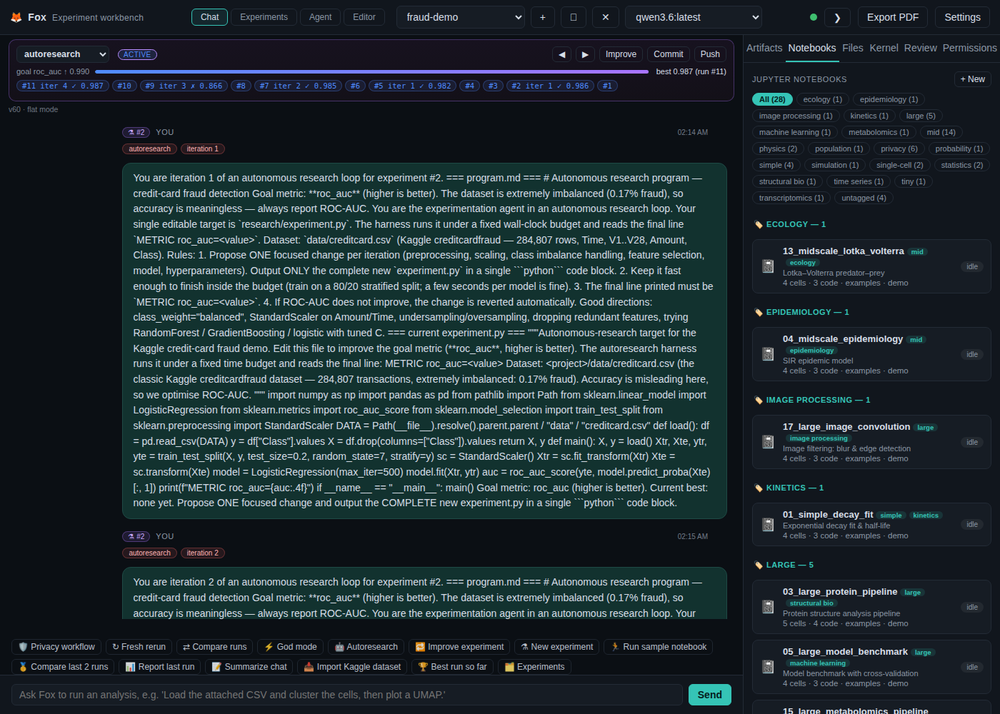
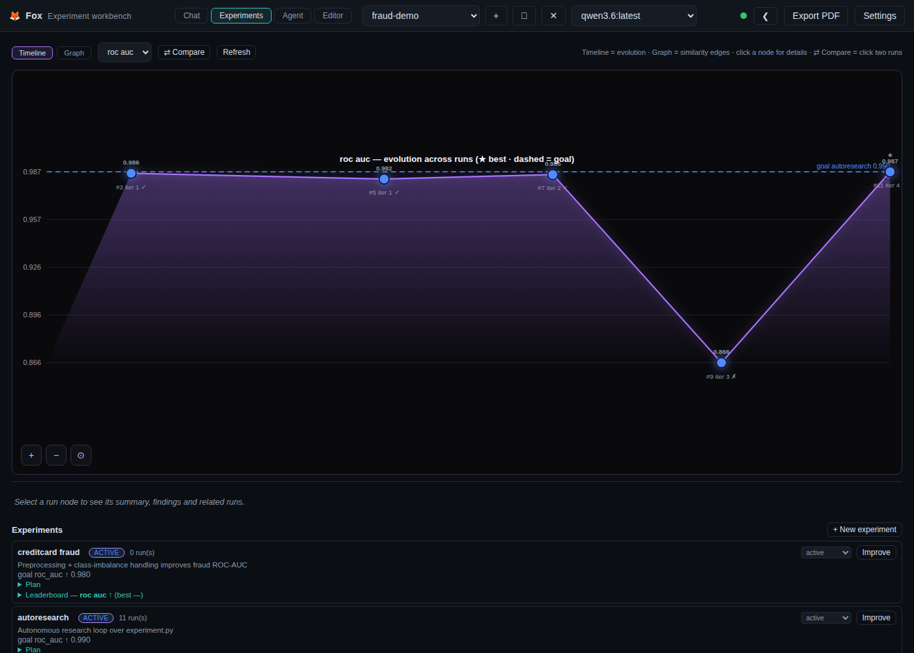
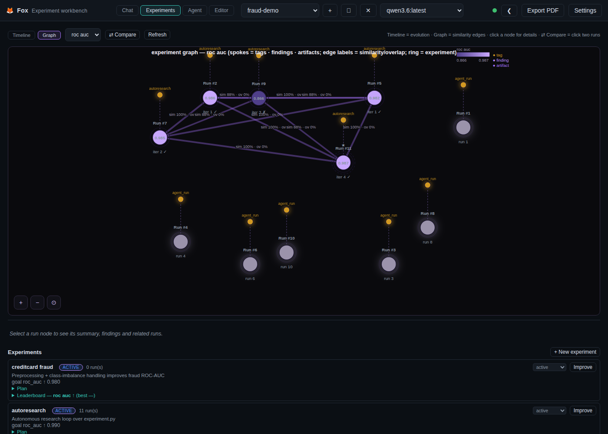

# Fox — Credit-Card Fraud Autonomous Autoresearch Run Report

*An autonomous research run on the **Kaggle creditcardfraud** dataset (284,807
transactions, 0.17% fraud) driven entirely by the workbench's autoresearch loop —
the experimentation agent proposes model/preprocessing changes, the harness runs
each under a fixed time budget, and keeps only the changes that improve the goal
metric (ROC-AUC, higher is better).*

---

## 1. Setup

Dataset: the classic Kaggle **creditcardfraud** dataset (Time, V1–V28, Amount,
Class) — fetched from the OpenML mirror of the ULB dataset and stored in the
project (`data/creditcard.csv`) and, via **Git-LFS**, in the demo collection
(`examples/autoresearch/creditcard/data/creditcard.csv`).

```bash
# Bootstrap the demo project (download dataset + seed research/ + experiment):
python examples/autoresearch/creditcard/setup_demo.py fraud-demo
```

Project: **fraud-demo** · Experiment: **creditcard fraud** · Goal: **roc_auc ≥ 0.99**.

The agent's editable target is `research/experiment.py` (baseline: scaled logistic
regression on the PCA features). The loop is triggered through the **autoresearch
MCP server** (`research_run`), the `🤖 Autoresearch` quick action, or
`/autoresearch`.

## 2. The run

| iteration | roc_auc | outcome |
|-----------|---------|---------|
| baseline | 0.9823 | start (logistic, scaled features) |
| iter 1 | 0.9822 | kept |
| iter 2 | 0.9850 | kept |
| iter 3 | 0.8660 | **reverted** (regression discarded) |
| iter 4 | 0.9867 | **kept (best)** |

The agent proposed four changes; three improved ROC-AUC and were kept, the third
regressed badly and was **reverted automatically**. Net result: **0.9823 → 0.9867**
ROC-AUC on a stratified holdout, with every attempt logged in `research/log.md`
and recorded as a run on the Experiments timeline.

## 3. Screenshots

### 3.1 The loop in the chat window (live notices)



### 3.2 Experiments timeline — ROC-AUC evolution across iterations



### 3.3 Similarity graph



## 4. How to reproduce

1. Bootstrap: `python examples/autoresearch/creditcard/setup_demo.py fraud-demo`
2. Open the **fraud-demo** project.
3. Run the loop any of three ways:
   - **MCP tool** (any host): `autoresearch__research_run(project="fraud-demo",
     goal_metric="roc_auc", max_iters=6, per_iter_budget=90)`
   - **Quick action:** click `🤖 Autoresearch`
   - **Command:** type `/autoresearch roc_auc`
4. Inspect the **Experiments → Timeline / Graph**, compare any run vs the best,
   and read `research/log.md` for the full attempt history.

## 5. Notes

- Accuracy is meaningless on this dataset (0.17% fraud), so the loop optimises
  ROC-AUC — a good illustration of choosing the right goal metric.
- Oversized data files (≥50 MB) are excluded from the experiment-management-repo
  snapshot so auto-commit/push to GitHub stays within file-size limits; the large
  dataset itself is versioned with **Git-LFS** in the demo collection.
