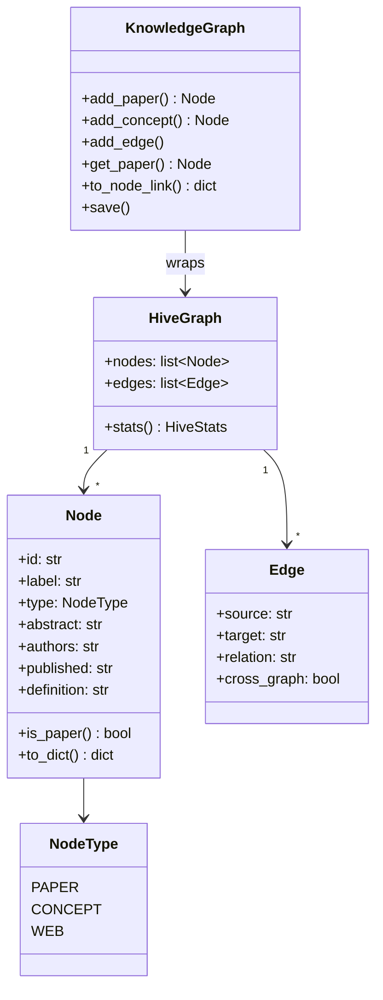
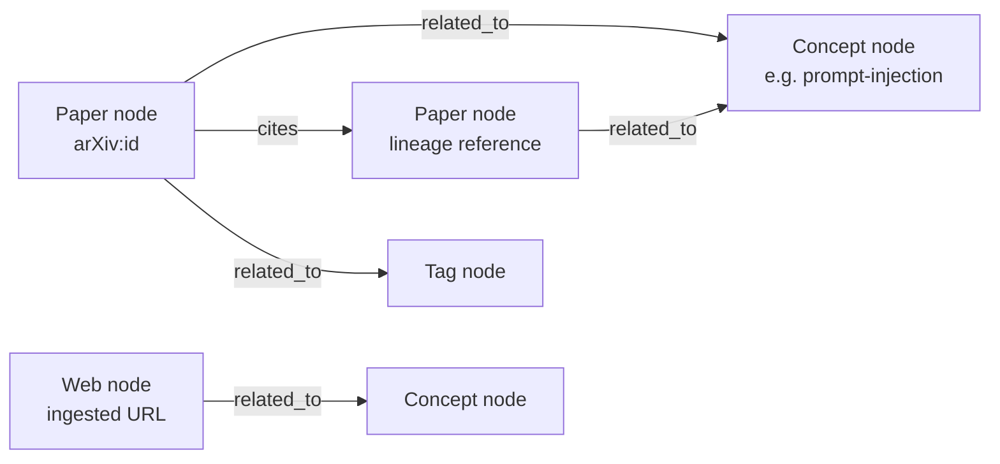
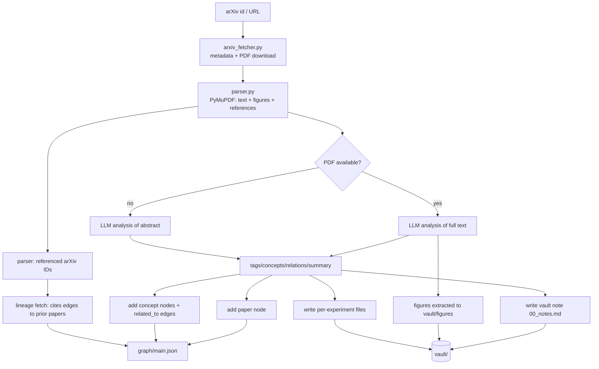
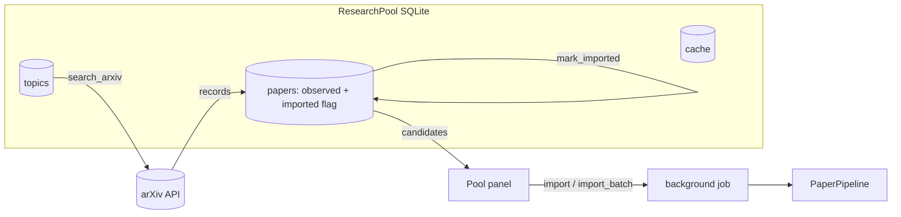
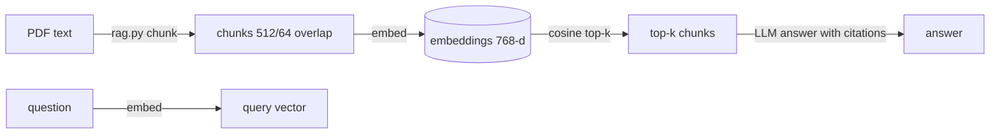
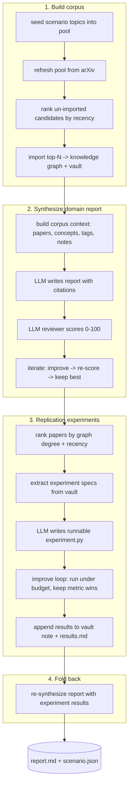
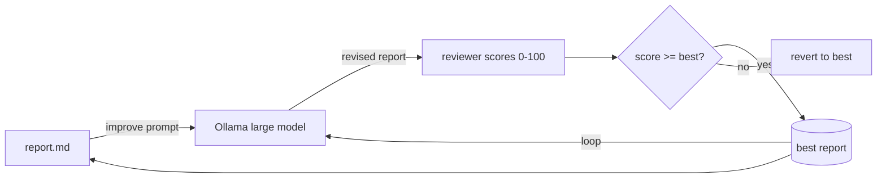
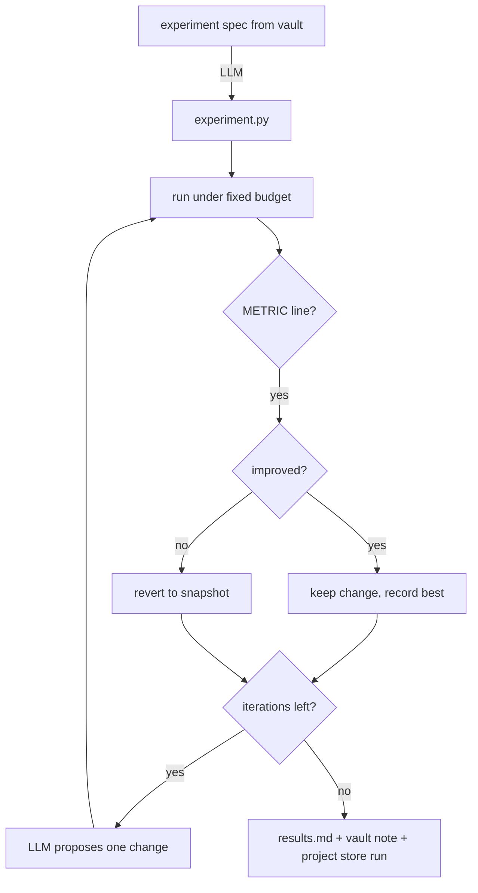
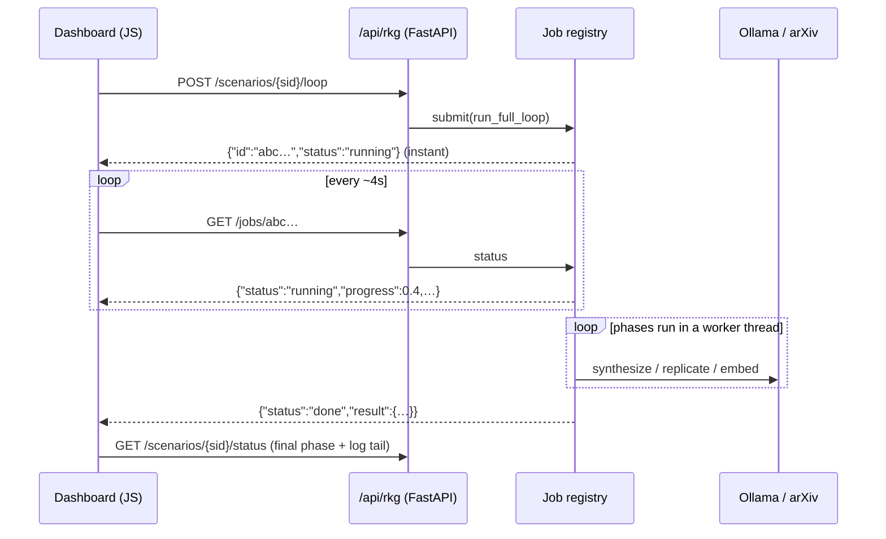

# Knowledge Graphs & Research Workbench

The workbench turns a raw arXiv paper into a typed knowledge graph, a RAG
searchable vault, and — with the **Research Workbench** — a fully autonomous
per-domain research loop that builds corpora, synthesizes literature reports,
and runs replication experiments.

Everything lives in `backend/research_knowledge_graphs/` and is exposed through
a single FastAPI router namespaced at `/api/rkg/*`, with two SPA views served at
`/rkg/dashboard` and `/rkg/landscape`. No ingested papers, graphs, or notes are
committed to the repo — all runtime data lands under
`<FOX_WORKBENCH_DIR>/research_knowledge_graphs/` (gitignored).

---

## 1. Architecture overview

```mermaid
flowchart LR
    subgraph Browser
        UI[Knowledge Graphs tab<br/>(iframe of /rkg/dashboard)]
    end

    subgraph Backend [FastAPI app]
        R[router.py<br/>/api/rkg/* + /rkg/* views]
        J[Job registry<br/>background threads + polling]
        WB[Research Workbench<br/>research_loop.py]
    end

    subgraph Research [research_knowledge_graphs modules]
        O[Organizer<br/>orchestrator]
        P[PaperPipeline<br/>pipeline.py]
        KG[(KnowledgeGraph<br/>Hive typed graph)]
        POOL[(ResearchPool<br/>SQLite topic monitor)]
        RAG[RAGEngine<br/>embeddings + cosine]
        LLM[LLMInterface<br/>Ollama]
        W[WebIngester]
        S[Similarity]
        GPU[GPUManager<br/>nvidia-smi]
    end

    subgraph Storage [gitignored data root]
        PAPERS[(papers/ PDFs)]
        VAULT[(vault/ markdown notes + figures)]
        GRAPH[(graph/ JSON)]
        SC[(scenarios/ config + reports)]
    end

    subgraph External
        ARXIV[(arXiv API + PDFs)]
        OLLAMA[(Ollama<br/>chat + embeddings)]
    end

    UI --> R
    R --> J
    R --> WB
    R --> O
    O --> P --> KG
    O --> RAG
    O --> POOL
    O --> W
    O --> S
    O --> LLM
    LLM --> OLLAMA
    P --> ARXIV
    POOL --> ARXIV
    KG --> GRAPH
    P --> PAPERS
    P --> VAULT
    WB --> SC
    GPU --> OLLAMA
```

**Request flow:** the dashboard iframe calls the namespaced REST API. Read-only
endpoints call the `Organizer` directly (heavy blocking work via
`asyncio.to_thread`). Long operations (paper ingestion, the research loop
phases) are submitted to the **job registry**, which returns a job id
immediately; the dashboard polls `GET /api/rkg/jobs/{id}` and the per-scenario
status endpoint until the work completes.

---

## 2. Data model

A **Hive knowledge graph** (`hive_datatype.py`) holds typed `Node`s and directed
`Edge`s, persisted as JSON (`graph/main.json`). Each node also owns a
**vault note** — a human-readable markdown file that is the audit trail of the
LLM analysis.





Node types and edge semantics:

| Node / edge | Meaning |
|---|---|
| `PAPER` | an ingested (or lineage-fetched) arXiv paper |
| `CONCEPT` | an extracted domain concept with a definition |
| `WEB` | a web page ingested via URL |
| `related_to` | paper ⇄ tag / concept association |
| `cites` | paper → referenced arXiv paper (lineage) |

---

## 3. Paper ingestion pipeline

The path from an arXiv id to a fully analyzed, graph-linked paper:



Per paper, the LLM extracts:

- **tags** — short keywords (fast model)
- **summary** + **notes** — method, architecture, results with numbers
- **experiments[]** — structured experiment specs (goal, methodology, dataset,
  setup, baselines, metrics, results, findings) written to
  `*-00-experiment.md` files
- **concepts[] / relations[]** — graph primitives with definitions
- **lineage_notes** — prior work and how the paper differs

---

## 4. Research pool (arXiv topic monitor)

`pool.py` maintains a SQLite database of **topics** (name → arXiv query). Every
12h (and on demand) it searches arXiv for each topic, records every observed
paper with its topics, and marks which papers have been imported into the
knowledge graph. The dashboard's Pool view lets you browse candidates and
import them in bulk.



Topics are seeded with general defaults plus the scenario topics of the two
sample Research Workbench domains.

---

## 5. RAG search

Each imported paper's full text is chunked, embedded with
`nomic-embed-text` (via Ollama), and stored in an in-memory vector index. A
question is embedded and answered over the top-k chunks with citations:



---

## 6. Research Workbench — autoresearch loops

The flagship: a **scenario** is a research domain (arXiv topics + a research
lens). Two sample scenarios ship with the tool:

| Scenario id | Name | Lens |
|---|---|---|
| `autonomous-agents-security` | Autonomous Agents & Security Lapses | security lapses of autonomous agents |
| `enterprise-ai-security` | Enterprise AI Adoption & Security Lapses | AI adoption in the enterprise + production security lapses |

The chained loop (`research_loop.py`) runs four phases over the corpus:



**The synthesis loop in detail** — the research analog of the classic
`experiment.py` autoresearch loop: the *artifact under improvement* is the
domain report, and the *metric* is the LLM reviewer's 0–100 score:



**The replication improve loop** — per chosen paper, the classic metric
keep/revert loop over `experiment.py`:



Every loop run is recorded in the scenario's **project store**
(`scenarios/<id>/project/workbench.db`) as runs attached to a per-scenario
experiment — so the Research Workbench results appear in the workbench's own
experiment timeline.

Per-scenario state under `<root>/scenarios/<scenario_id>/`:

```
scenario.json     config + corpus paper ids + best score + last loop results
report.md         best domain report (markdown)
log.md            append-only research log
experiments/      per-paper experiment.py + results.md
project/          ProjectStore DB (runs, messages, experiments)
```

---

## 7. Background jobs

Paper ingestion and the research-loop phases take minutes (arXiv + multiple LLM
calls + embeddings). Holding a browser fetch open that long fails with a
`NetworkError`, so long endpoints submit work to the **job registry** instead:



---

## 8. API reference (`/api/rkg/*`)

### Research pool & papers

| Endpoint | Method | Purpose |
|---|---|---|
| `/api/rkg/pool` | GET | pool feed (cached topic → papers) |
| `/api/rkg/pool/topics` | GET | list monitor topics |
| `/api/rkg/pool/topics/add` · `/remove` | POST | manage topics |
| `/api/rkg/pool/papers` · `/graph` | GET | observed papers / similarity graph |
| `/api/rkg/pool/import` · `/import_batch` | POST | import one / many (job) |
| `/api/rkg/papers` · `/papers/search` | GET | graph papers |
| `/api/rkg/add` | POST | add a paper by arXiv id (job) |
| `/api/rkg/search` · `/import` | POST | search arXiv / import all results (job) |

### Graph, browse, retrieval

| Endpoint | Method | Purpose |
|---|---|---|
| `/api/rkg/graph` · `/stats` | GET | node-link graph / counts |
| `/api/rkg/concepts` | GET | concept list |
| `/api/rkg/browse` · `/read` · `/raw` | GET | file tree / file contents |
| `/api/rkg/graph/detail` | POST | LLM-generate edge details (job) |
| `/api/rkg/definitions` | POST | fill concept definitions (job) |
| `/api/rkg/query` | POST | RAG question answering |
| `/api/rkg/lineage` | POST | fetch citations for a paper |
| `/api/rkg/similarity` | GET/POST | paper similarity matrix |
| `/api/rkg/web/add` · `/web/list` | POST/GET | web ingestion |

### Research Workbench scenarios

| Endpoint | Method | Purpose |
|---|---|---|
| `/api/rkg/scenarios` | GET | list scenarios + live status |
| `/api/rkg/scenarios/{sid}` | GET | scenario detail |
| `/api/rkg/scenarios/{sid}/status` | GET | live loop status (phase, progress, log) |
| `/api/rkg/scenarios/{sid}/report` | GET | best domain report (markdown) |
| `/api/rkg/scenarios/{sid}/build` | POST | phase 1 — build corpus (job) |
| `/api/rkg/scenarios/{sid}/synthesize` | POST | phase 2/4 — synthesize report (job) |
| `/api/rkg/scenarios/{sid}/experiments` | POST | phase 3 — replication experiments (job) |
| `/api/rkg/scenarios/{sid}/loop` | POST | full chained loop (job) |

### Jobs & system

| Endpoint | Method | Purpose |
|---|---|---|
| `/api/rkg/jobs/{id}` · `/jobs` | GET | job status / recent jobs |
| `/api/rkg/ollama` · `/gpu` · `/logs` | GET | model/GPU/system status |

---

## 9. Configuration

Runtime data root (default `<FOX_WORKBENCH_DIR>/research_knowledge_graphs/`),
Ollama endpoints, arXiv behavior and GPU settings all come from `config.py`.
Ollama falls back to the workbench's own `CONFIG` LLM wiring, so inside the
Docker image the RKG reaches the same relayed Ollama as the rest of the app
(e.g. `host.docker.internal:11435`).

```yaml
directories:
  root: /path/to/data
  papers: /path/to/data/papers
  graph: /path/to/data/graph
  vault: /path/to/data/vault

arxiv:
  max_results: 10
  download_pdf: true

ollama:
  base_url: http://localhost:11434   # or OLLAMA_BASE_URL env var
  model: qwen3.6:35b                 # or OLLAMA_MODEL
  fast_model: llama3.2:3b            # or OLLAMA_FAST_MODEL
  embed_model: nomic-embed-text      # or OLLAMA_EMBED_MODEL
```

---

## 10. Running it

```bash
# dev server
uvicorn backend.main:app --port 8765

# open the Knowledge Graphs tab (or directly)
#   http://localhost:8765/rkg/dashboard
#   http://localhost:8765/rkg/landscape
```

**Worked example of the Research Workbench:** open the **Research** panel in
the dashboard, pick the *Autonomous Agents & Security Lapses* scenario, and hit
**Full loop**. The loop builds the corpus (~10–15 min: pool refresh + per-paper
LLM analysis), synthesizes a report (auto-scored 0–100, improved each
iteration), replicates the strongest papers' experiments, and folds the results
back into the final report. Watch the live phase/progress/log, then open
**Report** to read the result.
