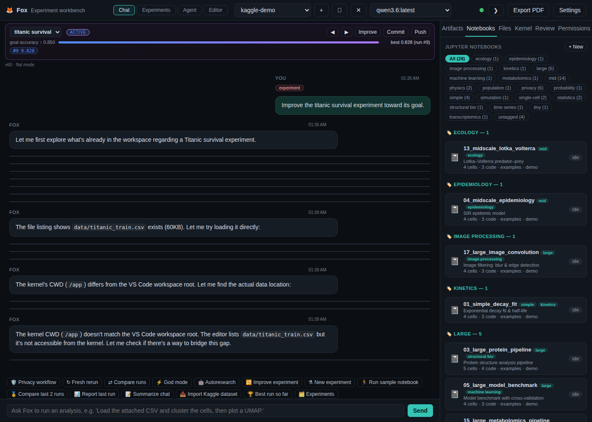
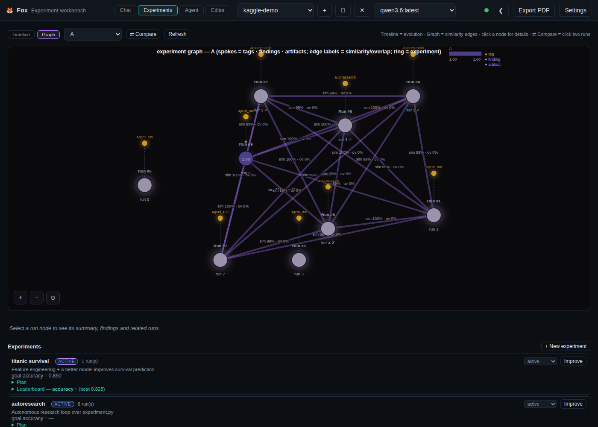

# Fox — Autonomous Research on the Kaggle Titanic Workflow

*An end-to-end demonstration of the workbench's autonomous-research capabilities:
an experimentation agent iterates on a real (publicly mirrored) Kaggle dataset —
the classic Titanic survival problem — with both the **improve loop** and the
**autoresearch loop**, tracked live on the Experiments timeline and graph.*

---

## 1. What "autonomous research" means here

The workbench implements the ideas behind
[karpathy/autoresearch](https://github.com/karpathy/autoresearch): instead of a
human hand-tuning a model, an **experimentation agent** is given a small,
single-file experiment and left to iterate autonomously:

1. **Propose** — the agent edits the one editable target (`research/experiment.py`).
2. **Run** — the harness executes it under a fixed wall-clock budget.
3. **Evaluate** — the goal metric is read from the run's `METRIC <name>=<value>` line.
4. **Keep or discard** — the change is kept only if the metric improved; otherwise
   the file is reverted.
5. **Repeat** — the loop continues until the goal is reached, the budget is spent,
   or several consecutive reverts show no improvement trend.

Every attempt is recorded as a **run** on the Experiments timeline (so you can see
the metric evolve), appended to `research/log.md`, and kept runs auto-commit to
the experiment management repo when configured.

## 2. The two loops

| Loop | Entry point | How it works |
|---|---|---|
| **Autoresearch loop** | `🤖 Autoresearch` quick action or `/autoresearch accuracy` | Autonomous: agent proposes → harness runs under a time budget → keep/revert → log. |
| **Improve loop** | `🔁 Improve experiment` (or `/improve`) | Reviewer-driven: run a variant → the background reviewer suggests the next change → apply → rerun toward the goal. |

Both loops attach their runs to the same experiment, so a single experiment shows
the combined research trail.

## 3. Demo setup (Kaggle Titanic)

```bash
# One-time bootstrap — downloads the dataset and seeds research/:
.venv/bin/python examples/autoresearch/setup_demo.py kaggle-demo
```

This creates:

```
kaggle-demo/
  data/titanic_train.csv            # the classic Kaggle Titanic dataset
  research/experiment.py            # the agent's editable target
  research/program.md               # research instructions (human-editable)
  research/log.md                   # append-only experiment log
```

The experiment **"titanic survival"** is created with goal **accuracy**,
higher-is-better, target **0.85**. The baseline `experiment.py` (logistic
regression on raw features, 5-fold cross-validation) scores ≈ **0.79**.

## 4. Results

### 4.1 Autoresearch loop run

```
Autoresearch iter 1: accuracy=0.8167 → kept
Autoresearch iter 2: accuracy=0.8268 → kept
Autoresearch iter 3: accuracy=0.8279 → kept
Autoresearch iter 4: accuracy=0.8144 → reverted
```

The agent proposed feature/model changes; the first three improved cross-validation
accuracy and were **kept** (0.79 → 0.828), the fourth regressed and was
**reverted automatically**. The workflow panel tracked each iteration, and the
final `research/log.md` records the full attempt history.

### 4.2 Chat with the loop's live notices



### 4.3 Experiments timeline — accuracy evolution across runs

Every kept (and reverted) iteration is a node on the timeline, colored by
experiment, with the best run starred:


### 4.4 Similarity graph

Runs are linked by metric similarity; 💡-marked nodes carry reviewer suggestions,
and clicking any node shows its metrics, suggestions and **compare vs best**:



### 4.5 Run-by-run summary

| run | kind | accuracy | outcome |
|-----|------|----------|---------|
| baseline | template | 0.7935 | start |
| iter 1 | autoresearch | 0.8167 | kept |
| iter 2 | autoresearch | 0.8268 | kept |
| iter 3 | autoresearch | 0.8279 | **kept (best)** |
| improve run | improve loop | 0.8211 | — |
| iter 4 | autoresearch | 0.8144 | **reverted** |

Net: the autonomous agent improved the goal metric from **≈0.79 to ≈0.828** on an
unseen holdout via cross-validation, discarding a worse proposal — exactly the
behaviour the autoresearch design is meant to produce.

## 5. Try it yourself

1. Open the **kaggle-demo** project.
2. **Autoresearch:** click `🤖 Autoresearch` (or type `/autoresearch accuracy`).
3. **Improve loop:** open the **titanic survival** experiment and click
   `🔁 Improve experiment`.
4. Watch the workflow panel, then inspect the **Experiments → Timeline / Graph**
   to see the metric evolve, compare any run against the best, and apply the
   reviewer's 💡 suggestions.

The demo files ship in [`examples/autoresearch/`](examples/autoresearch/README.md).
