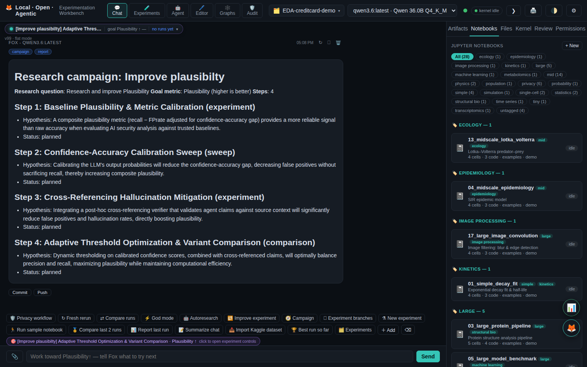
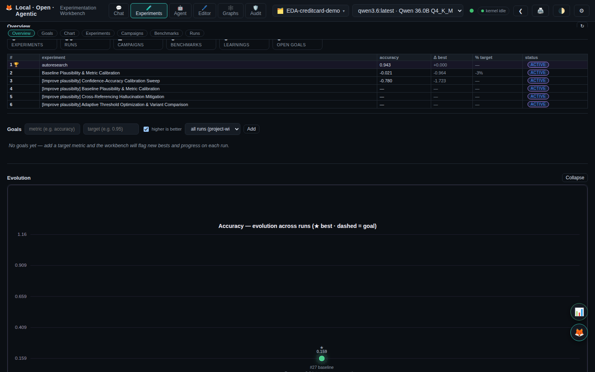
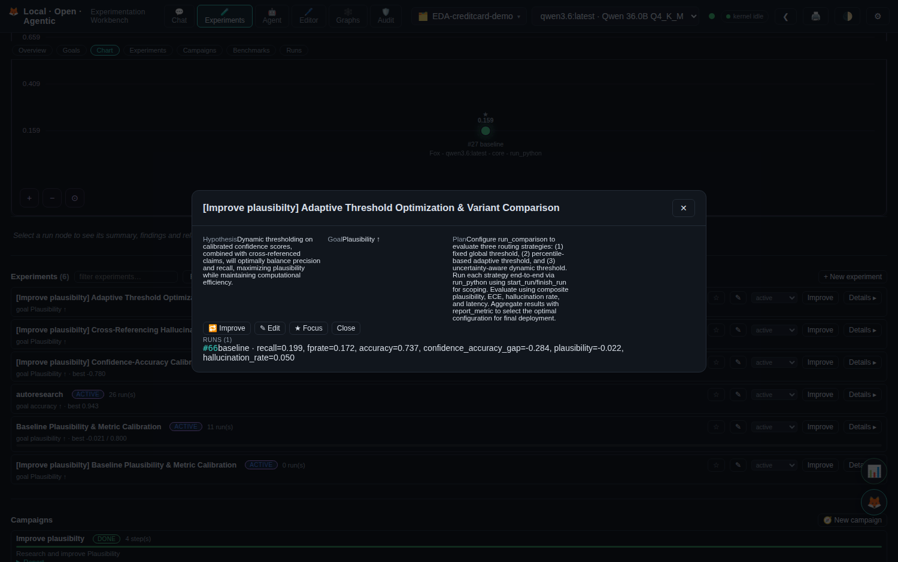
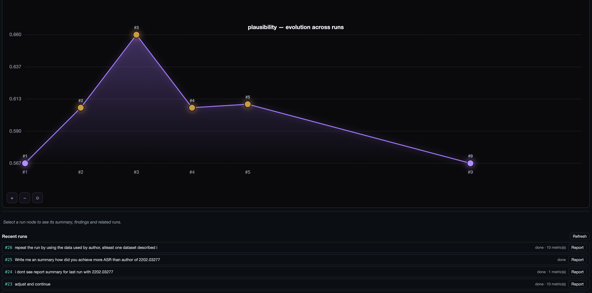
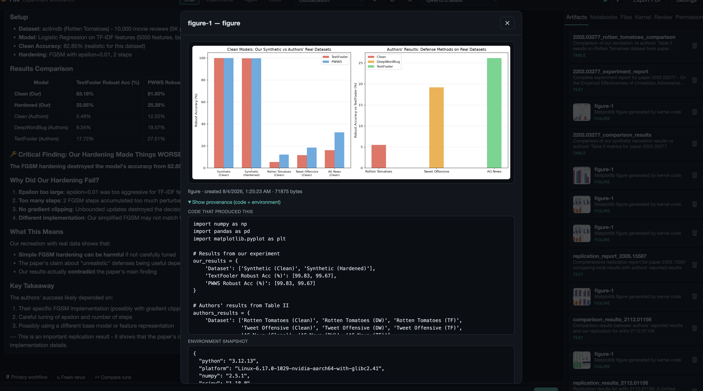
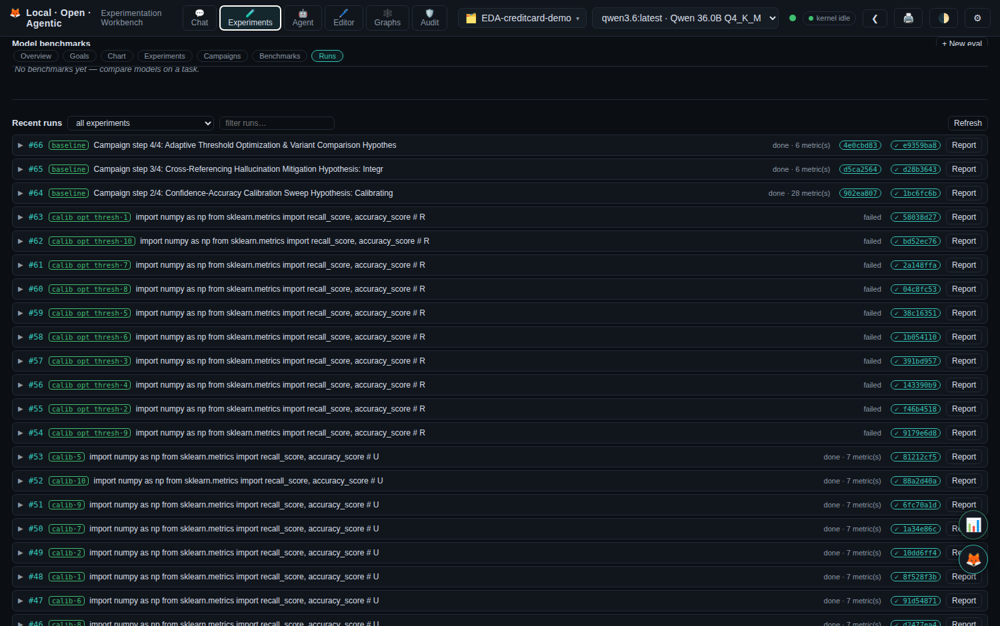
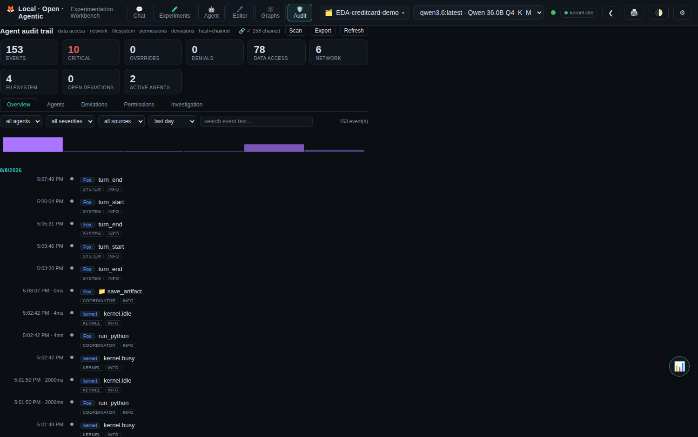

# Local · Open · Agentic Experimentation Workbench

A fully local, open-source experiment workbench — the local-models equivalent of
"Claude Science". It runs entirely on your machine with local LLMs (via Ollama),
so your data never leaves home unless you explicitly approve a network command.
The assistant persona is **Fox** (🦊).

This GitBook is the project's detailed, user- and developer-facing
documentation. The repository root also contains a growing set of design notes
under `docs/` (per-round feature designs) and practical guides (`HOW-to-USE.md`,
`commands.md`).

## What it does

- **Chat-driven agent** with a persistent Python/R kernel, Jupyter notebooks,
  full artifact provenance, and a background reviewer.
- **Experiment tracking**: experiments with goal metrics and targets, per-run
  recording (config, metrics, full code, environment), leaderboards, run
  comparison and diffs.
- **Autonomous research**: reviewer-driven improve loops, parameter sweeps,
  multi-step research campaigns (background, resumable), and model benchmarks.
- **Knowledge memory**: every measured outcome becomes a *learning* that feeds
  back into the agent's context, the reviewer, and the campaign planner.
- **Verifiability**: git-backed run lineage, per-run content hashes (integrity),
  and a tamper-evident local audit trail.
- **Literature grounding**: a research-knowledge-graph (RKG) subsystem with a
  RAG index over arXiv/domain papers, used by planning, review and reports.
- **Documentation**: a comprehensive project report, next-research agenda, and
  a portable project export (zip).

## Screenshots

**Chat with Fox** — streaming agent turns with provenance labels.

**Experiments overview** — KPIs, the cross-experiment leaderboard, and compact experiment cards.

**Experiment detail** — leaderboard, learnings, and runs in one view.

**Experiment tracking cockpit** — timeline and similarity-graph views with goal lines, best-run highlight, and suggestions.

**Goals** — target metrics with progress bars and reached states.

**Campaigns** — background research investigations.

**Model benchmarks** — compare the workbench's LLMs on a task.

**Run detail** — expandable metrics, config, tool trail, and actions.

**Improve-loop lineage** — the git-flow branch graph.

**Generated report** — the project write-up rendered in chat.

**Audit trail** — tamper-evident, hash-chained event timeline.

> Screenshots are illustrative (a seeded "Demo" project); the audit view shows
> real recorded events.

## Key concepts at a glance

| Concept | Meaning |
|---|---|
| Project | One research workspace (SQLite store, kernels, artifacts). |
| Run | One recorded agent turn (prompt → reply → tool trail → metrics). |
| Experiment | A family of runs around one goal (metric + target). |
| Focus | The experiment the agent steers toward (anti-drift). |
| Goal | A target metric tracked across runs (Goals panel). |
| Learning | A measured outcome worth remembering (✓ improved / ✗ no gain). |
| Campaign | A planned multi-step research investigation run in the background. |
| Benchmark (eval) | Comparing the workbench's LLMs on a task. |
| Integrity hash | sha256 of a run's canonical record (tamper-evident). |
| Audit chain | Hash-chained, redacted event log per project. |

## Services (Docker)

| Container | Service | Port |
|---|---|---|
| `fox-workbench` | FastAPI + WebSocket chat + frontend | `0.0.0.0:8765` |
| `fox-code-server` | In-browser VS Code (code-server) | `0.0.0.0:8787` |
| `fox-ollama-relay` | socat relay to host Ollama (11435) | internal |

> Defaults are overridable via env vars (see [Configuration](getting-started/configuration.md)
> and [Environment variables](reference/environment-variables.md)).
